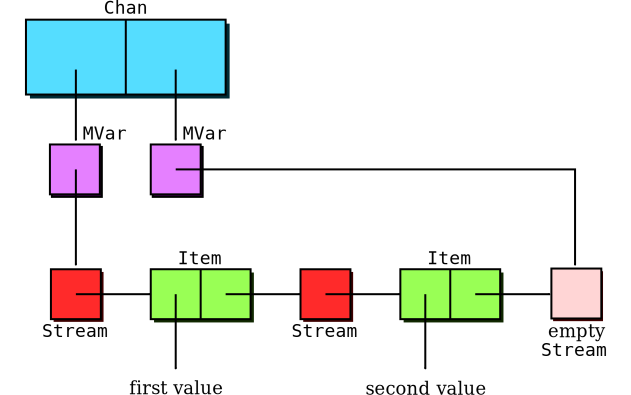
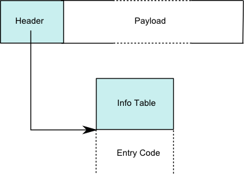

# Basics

## Tip: variable names

* Inner functions (e.g., `loop`) often have arguments related to
  outer function
    * It is legal to shadow bindings and re-use variable names, but
      the compiler will warn you
    * Typical practice is to add `'` (prime) to the inner-function's
      argument
    * Haskell accepts the `'` character in variables, except as first
      character
* Personally, I find this practice a bit error-prone
    * While learning Haskell, I repeatedly made the error of dropping
      primes, e.g.:

    ~~~ {.haskell}
    factorial n = loop 1 n
        where loop acc n' | n' > 1    = loop (acc * n) (n' - 1) -- bug
                          | otherwise = acc
    ~~~

    * You can avoid the problem by using the longer symbol name for
      the outer function

    ~~~ {.haskell}
    factorial n0 = loop 1 n0
        where loop acc n | n > 1     = loop (acc * n) (n - 1)
                         | otherwise = acc
    ~~~

    * Here accidentally typing "`factorial n0 = loop 1 n`" causes
      compile error

## Running `urldump`

~~~~
$ ghc --make urldump
[1 of 1] Compiling Main             ( urldump.hs, urldump.o )
Linking urldump ...
$ ./urldump http://www.scs.stanford.edu/
<!DOCTYPE HTML PUBLIC "-//W3C//DTD HTML 4.01//EN"
...
~~~~

* What if you want to run it in GHCI?

    ~~~~
$ ghci ./urldump.hs
Prelude Main>
    ~~~~

    * No `*` before `Main` means no access to internal symbols (because
      compiled)

    ~~~~
Prelude Main> :load *urldump.hs
[1 of 1] Compiling Main             ( urldump.hs, interpreted )
Ok, modules loaded: Main.
*Main> withArgs ["http://cs240h.scs.stanford.edu/"] main
    ~~~~

    * Alternate GHCI shortcut:

    ~~~~
Prelude Main> :main "http://cs240h.scs.stanford.edu/"
    ~~~~

## The [Dreaded][DMRWiki] [Monomorphism Restriction][DMR] (DMR)

* Let's say you want to cache result of super-expensive function

    ~~~~ {.haskell}
    superExpensive val = len $ veryExpensive (val :: Int)
        where len [] = 0
              len (x:xs) = 1 + len xs
    cachedResult = superExpensive 5
    ~~~~

    * `cachedResult` will start as thunk, be executed once, then
      contain value

* Let's think about the types

    ~~~~
    *Main> :t superExpensive
    superExpensive :: Num a => Int -> a
    *Main> :t cachedResult
    cachedResult :: Integer
    ~~~~

    * \+ and 0 are overloaded, so `superExpensive` can return any
      `Num` you want
    * Why don't we have `cachedResult :: (Num a) => a`?
    * Recall context restrictions are like hidden arguments... so
      would make `cachedResult` into a function, undermining our
      caching goal!
    * But how is compiler smart enough to save us here?

## The DMR continued

* Answer: in this case, compiler is not actually that smart
    * Heuristic: If it looks like a function, can infer *ad hoc*
      polymorphic types
    * If it looks like anything else, no *ad hoc* polymorphism unless
      explicitly declared
    * *parametric* polymorphic types can always be inferred (no hidden
      arguments)
* What looks like a function?
    * Has to bind a single symbol (`f`), rather than a pattern (`(x,
      y)`, `(Just x)`)
    * Has to have at least one explicit argument (`f x =` ... ok, `f
      =` ... not)
* How are monomorphic types inferred?
    * If bound symbol used elsewhere in module, infer type from use
    * If still ambiguous and type is of class `Num`, try `Integer`
      then `Double` (this sequence can be changed with a
      [`default` declaration][default])
    * If still ambiguous, compilation fails

## The DMR take-away message

* Think of type restrictions as implicit dictionary arguments
    * Compiler won't saddle non-function with implicit arguments
* This code will compile

    ~~~~ {.haskell}
    -- Compiler infers: show1 :: (Show x) => x -> String
    show1 x = show x
    ~~~~

* But neither of these will:

    ~~~~ {.haskell}
    show2 = show
    show3 = \x -> show x
    ~~~~

    * I'd rather you heard it from me than from GHC...

* Relatively easy to work around DMR
    * Add type signatures to functions--a good idea anyway for
      top-level bindings, and sometimes necessary for `let` bindings

        ~~~~ {.haskell}
        -- No problem, compiler knows you want ad hoc polymorphism
        show2 :: (Show x) => x -> String
        show2 = show
        ~~~~

[DMR]: http://www.haskell.org/onlinereport/haskell2010/haskellch4.html#x10-930004.5.5
[DMRWiki]: http://www.haskell.org/haskellwiki/Monomorphism_restriction

# Memory

## `seq` revisited

* Recall `seq :: a -> b -> b`
    * If `seq a b` is forced, then first `a` is forced, then `b` is
      forced and returned
* Consider the following code:

    ~~~~ {.haskell}
    infiniteLoop = infiniteLoop :: Char   -- loops forever

    seqTest1 = infiniteLoop `seq` "Hello" -- loops forever

    seqTest2 = str `seq` length str       -- returns 6
        where str = infiniteLoop:"Hello"
    ~~~~

    * `seqTest1` hangs forever, while `seqTest2` happily returns 6
* `seq` only forces a `Val`, not the `arg` fields of the `Val`
    * `seqTest2`'s `seq` forces `str`'s constructor `(:)`, but not the
      head or tail
    * This is known as putting `str` in *Weak Head Normal Form* (WHNF)
    * Can't fully evaluate an arbitrary data type (but see
      [Control.DeepSeq](http://hackage.haskell.org/packages/archive/deepseq/latest/doc/html/Control-DeepSeq.html))

## Semantic effects of strictness

* Strictness is primarily used for optimization
    * To avoid building up long chains of thunks
    * To save overhead of checking whether thunk evaluated
* But has semantic effects:  A non-strict `Int` is not just a number
    * Can also throw an exception or loop forever when evaluated
    * Such behavior can be modeled as a special value $\bot$
      ("bottom")
    * So the values of `Int` are $\{0,1\}^{64} \cup \{\bot\}$
    * Types that include value $\bot$ are called *lifted*
* Note 1: an unboxed type is necessarily unlifted
* Note 2: `!Int` not a first-class type, only valid for `data` fields

    ~~~~ {.haskell}
    data SMaybe a = SJust !a | SNothing   -- ok, data field
    strictAdd :: !Int -> !Int -> !Int     -- error
    type StrictMaybeInt = Maybe !Int      -- error
    ~~~~

## `newtype` semantics

* What's the semantic difference between these two declarations?

    ~~~~ {.haskell}
    newtype NTInt = NTInt Int deriving (Show)
    ~~~~

    ~~~~ {.haskell}
    data SInt = SInt !Int deriving (Show)
    ~~~~

* The `NTInt` constructor is a "fake" compile-time-only construct
    * A case statement deconstructing a `newtype` compiles to nothing

    ~~~~ {.haskell}
    newtype NTInt = NTInt Int deriving (Show)
    uNTInt = NTInt undefined
    testNT = case uNTInt of NTInt _ -> True   -- returns True

    data SInt = SInt !Int deriving (Show)
    uSInt = SInt undefined
    testS = case uSInt of SInt _ -> True      -- undefined
    ~~~~

## The [`UNPACK`][UNPACK] pragma

* `newtype` almost always better than `data` when it applies
* What about a multi-field data type?

    ~~~~ {.haskell}
    data TwoInts = TwoInts !Int !Int
    ~~~~

    * Fields are strict, we know they'll have `CONSTRNO` `ValInfo`
    * Why not stick the `Int#`s directly into the `args` of a
      `TwoInts` `Val`?
    * GHC provides an `UNPACK` pragma to do just this

        ~~~~ {.haskell}
        data TwoInts = TwoInts {-# UNPACK #-} !Int {-# UNPACK #-} !Int
        ~~~~

    * Works for any strict field with a single-constructor datatype
* Unlike `newtype`, `UNPACK` is not always a win
    * If you pass field as argument, will need to re-box it
* `-funbox-strict-fields` flag unpacks *all* strict fields

## User-managed memory

* Opaque type [`Ptr a`][Ptr] represents pointers to type `a`
    * Pointers are not typesafe--allow pointer arithmetic and casting

        ~~~~ {.haskell}
        nullPtr :: Ptr a
        plusPtr :: Ptr a -> Int -> Ptr b
        minusPtr :: Ptr a -> Ptr b -> Int
        castPtr :: Ptr a -> Ptr b
        ~~~~

    * Pointer arithmetic is always in units of bytes (unlike in C,
      where unit is size of the pointed-to object)
* Class [`Storable`][Storable] provides raw access to memory using
  `Ptr`s

    ~~~~ {.haskell}
    class Storable a where
        sizeOf :: a -> Int
        alignment :: a -> Int
        peek :: Ptr a -> IO a
        poke :: Ptr a -> a -> IO ()
        ...
    ~~~~

    * Most basic types (`Bool`, `Int`, `Char`, `Ptr a`, etc.) are `Storable`

## `alloca`

* Easiest way to get a valid `Ptr` is `alloca`:

    ~~~~ {.haskell}
    alloca :: Storable a => (Ptr a -> IO b) -> IO b
    ~~~~

    * Allocates enough space for an object of type `a`
    * Calls function with a `Ptr` to the space
    * Reclaims the memory when the function returns (much like C
      `alloca`)
    * Can also ask for a specific number of bytes:

    ~~~~ {.haskell}
    allocaBytes :: Int -> (Ptr a -> IO b) -> IO b
    ~~~~

* `Foreign` module provides handy [`with`][with] utility

    ~~~~ {.haskell}
    with :: Storable a => a -> (Ptr a -> IO b) -> IO b
    with val f  =
      alloca $ \ptr -> do
        poke ptr val
        res <- f ptr
        return res
    ~~~~

## More `Storable` types

* `Foreign.C` contains wrappers for C types
    * `CInt`, `CUInt`, `CChar`, `CDouble`, `CIntPtr` etc.
* `Data.Int` and `Data.Word` have all sizes of machine integer
    * `Int8`, `Int16`, `Int32`, `Int64` -- signed integers
    * `Word8`, `Word16`, `Word32`, `Word64` -- unsigned integers

* Example: extract all the bytes from a `Storable` object

    ~~~~ {.haskell}
    toBytes :: (Storable a) => a -> [Word8]
    toBytes a = unsafePerformIO $
        with a $ \pa -> go (castPtr pa) (pa `plusPtr` sizeOf a)
        where go p e | p < e = do b <- peek p
                                  bs <- go (p `plusPtr` 1) e
                                  return (b:bs)
                     | otherwise = return []
    ~~~~

    * `unsafePerformIO` might be okay here since `toBytes` pure
    * Notice how `plusPtr` lets us change from `Ptr a` to `Ptr Word8`

## `malloc` and `mallocForeignPtr`

* Can also allocate longer-lived memory with `malloc`

    ~~~~ {.haskell}
    malloc :: Storable a => IO (Ptr a)
    mallocBytes :: Int -> IO (Ptr a)
    free :: Ptr a -> IO ()
    realloc :: Storable b => Ptr a -> IO (Ptr b)
    reallocBytes :: Ptr a -> Int -> IO (Ptr a)
    ~~~~

    * Disadvantage:  bad programming can lead to memory
      leaks/corruption

* `ForeignPtr` lets you delegate deallocation to garbage collector

    ~~~~ {.haskell}
    mallocForeignPtr :: Storable a => IO (ForeignPtr a)
    mallocForeignPtrBytes :: Int -> IO (ForeignPtr a)
    ~~~~

## Working with `ForeignPtr`s

* To use `ForeignPtr`, must convert it to `Ptr`
    * Problem: How does GC know `ForeignPtr` in scope when using
      `Ptr`?
    * Solution: use `Ptr` within function that keeps reference to
      `ForeignPtr`

    ~~~~ {.haskell}
    withForeignPtr :: ForeignPtr a -> (Ptr a -> IO b) -> IO b
    ~~~~

* Can also convert `Ptr`s to `ForeignPtr`s

    ~~~~ {.haskell}
    type FinalizerPtr a = FunPtr (Ptr a -> IO ())
    newForeignPtr :: FinalizerPtr a -> Ptr a
                  -> IO (ForeignPtr a)
    newForeignPtr_ :: Ptr a -> IO (ForeignPtr a)
    addForeignPtrFinalizer :: FinalizerPtr a -> ForeignPtr a
                           -> IO ()
    ~~~~

    * Can add multiple finalizers, will run in reverse order
* Note use of `FunPtr` -- this is type wrapper for C function pointer
    * Need foreign function interface to create these
    * [`finalizerFree`][finalizerFree] symbol conveniently provides
      function pointer for `free`

## [Foreign function interface][FFI] (FFI)

* Can import foreign functions like this:

    ~~~~ {.haskell}
    foreign import ccall unsafe "stdlib.h malloc"
        c_malloc :: CSize -> IO (Ptr a)
    foreign import ccall unsafe "stdlib.h free"
        c_free :: Ptr a -> IO ()
    ~~~~

    * `ccall` says use C calling convention (also `cplusplus` and few
      others)
    * `unsafe` promises the C function will not call back into
      Haskell
    * `unafe` faster than `safe`, but gives undefined results if call
      triggers GC
* Spec for import string: `"`[`static`] [*c-header*] [`&`][*c-name*]`"`
    * `static` required only if *c-name* is `dynamic` or `wrapper`
    * *c-header* is a single `.h` file with the declaration
       (ignored by GHC)
    * '&' imports pointer rather than function (required for `FunPtr`s)

## FFI types

* FFI function arguments must be *basic foreign types*
    * `Char`, `Int`, `Double`, `Float`, `Bool`, `Int8`, `Int16`,
      `Int32`, `Int64`, `Word8`, `Word16`, `Word32`, `Word64`, `Ptr`
      `a`, `FunPtr a`, and `StablePtr a`
    * Also accepts any `type` or `newtype` wrappers for basic types
      (`CInt`, `CChar`, etc.) 
      [Documentation incorrectly says `data CInt`, but `:i` in GHCI
      reveals truth.]
* FFI function results can be
    * Any valid argument type
    * `()` (for functions returning `void`)
    * `IO a` where `a` is either of the above two
* Place result `IO` if function has side effects or non-determinism
    * Okay to omit if it is a pure C function:

        ~~~~ {.haskell}
        foreign import ccall unsafe "arpa/inet.h ntohl"
            ntohl :: Word32 -> Word32
        ~~~~

    * Haskell can't check C purity, so omitting `IO` can cause
      problems

## [`hsc2hs`][hsc2hs]

* How to access C data structures?

    ~~~~ {.c}
    struct mystruct {
      char *name;
      int value;
    };
    ~~~~

    * Might model with opaque placeholder type

    ~~~~ {.haskell}
    data MyStruct        -- no constructors, just a placeholder
    getValue :: Ptr MyStruct -> IO CInt
    getValue ptr = peek $ ptr `plusPtr` 8  -- assumes char * 8 bytes
    ~~~~

* [`hsc2hs`][hsc2hs] is pre-processor that lets you compute C values

    ~~~~ {.haskell}
    #include "myheader.h"
    getValue ptr = peek $ ptr `plusPtr`
                   #{offset struct mystruct, value}
    ~~~~

    * Super-simple implementation just uses C macros & `printf`
    * Find the file [`template-hsc.h`][template-hsc.h] on your system
      to see defs of `#` commands
    * Can also define your own macros with `#let` (like `#define` w/o
      parens)

## Lazy `ByteString` implementation

* Lazy `ByteString`s are implemented in terms of strict ones

    ~~~~ {.haskell}
    data ByteString = Empty
                    | Chunk {-# UNPACK #-} !S.ByteString ByteString
    ~~~~

    * Invariant: `Chunk`'s first argument (`S.ByteString`) never `null`
    * Basically a linked list of strict `ByteString`s
    * Head is strict, tail is not, allowing lazy computation or I/O

* When to use strict/lazy `ByteString`s?
    * Obviously use lazy when you need laziness (e.g., lazy I/O,
      infinite or cyclical strings, etc.)
    * Lazy also much faster at concatenation (need to build a new list
      of `S.ByteString`s, but not copy the data they contain)
    * Strict makes it much easier to implement things like string
      search
    * Converting strict to lazy `ByteString`s is cheap, reverse is not
      (so if a library can work efficiently on lazy `ByteString`s,
      good to expose that functionality)

## Exceptions in pure code

* Can `throw` exceptions in pure code, yet `catch` them only in `IO`
    * This is because evaluation order depends on implementation
    * Which error is thrown by `(error "one") + (error "two")`? 
      Can be non-deterministic, which is [okay][imprecise exceptions]
      if `catch` is restricted to the `IO` Monad
* In `IO`, use `throwIO` (not `throw`) to make exception sequencing
  precise

    ~~~~ {.haskell}
        do x <- throwIO (MyError "one")  -- this exception thrown
           y <- throwIO (MyError "two")  -- this code not reached
    ~~~~

* Beware `catch` only catches exceptions if code actually evaluated

    ~~~~ {.haskell}
    pureCatcher :: a -> IO (Maybe a)
    pureCatcher a = (a `seq` return (Just a))
                    `catch` \(SomeException _) -> return Nothing
    ~~~~

    ~~~~
    *Main> pureCatcher (undefined :: String)
    Nothing
    *Main> pureCatcher (undefined:undefined :: String)
    Just "*** Exception: Prelude.undefined
    ~~~~

[Ptr]: http://www.haskell.org/ghc/docs/latest/html/libraries/base-4.4.0.0/Foreign-Ptr.html#t:Ptr
[Storable]: http://www.haskell.org/ghc/docs/latest/html/libraries/base-4.4.0.0/Foreign-Storable.html#t:Storable
[GHC.Prim]: http://www.haskell.org/ghc/docs/latest/html/libraries/ghc-prim-0.2.0.0/GHC-Prim.html
[MagicHash]: http://www.haskell.org/ghc/docs/latest/html/users_guide/syntax-extns.html#magic-hash
[UNPACK]: http://www.haskell.org/ghc/docs/latest/html/users_guide/pragmas.html#unpack-pragma
[with]: http://www.haskell.org/ghc/docs/latest/html/libraries/base-4.4.0.0/Foreign-Marshal-Utils.html#v:with
[FFI]: http://www.haskell.org/onlinereport/haskell2010/haskellch8.html
[hsc2hs]: http://www.haskell.org/ghc/docs/latest/html/users_guide/hsc2hs.html
[template-hsc.h]: http://darcs.haskell.org/cgi-bin/gitweb.cgi?p=hsc2hs.git;a=blob;f=template-hsc.h;hb=HEAD
[bytestring]: http://www.haskell.org/ghc/docs/latest/html/libraries/bytestring-0.9.2.0/index.html
[ByteString.Lazy]: http://www.haskell.org/ghc/docs/latest/html/libraries/bytestring-0.9.2.0/Data-ByteString-Lazy.html
[finalizerFree]: http://www.haskell.org/ghc/docs/latest/html/libraries/base-4.4.0.0/Foreign-Marshal-Alloc.html#v:finalizerFree
[imprecise exceptions]: http://research.microsoft.com/en-us/um/people/simonpj/papers/imprecise-exn.htm

# Testing

## Type defaulting - a recap

Haskell's usual defaulting rules take each group of constraints `(C1 a, C2
a, ..., Cn a)` for each type variable `a`, and defaults the type
variable if all of the following conditions hold:

* The type variable `a` appears in no other constraints.

* All the classes `Ci` are standard.

* At least one of the classes `Ci` is numeric.

## That's not enough for us lazy programmers!

To reduce the number of types we're forced to specify by hand, `ghci`
relaxes the standard rules (changes in italics):

* The type variable `a` appears in no other constraints. *Unchanged*.

* All the classes `Ci` are standard, *and all are single-parameter
  type classes*.

* At least one of the classes `Ci` is numeric, *or is `Show`, `Eq`, or
  `Ord`*.

It also adds another critical step when defaulting:

* The type `()` becomes the first of the the standard list of types
  tried when doing type defaulting.

## Peek inside

We can use the `verboseCheck` function to see all the test data that
QuickCheck is generating for us.

~~~~ {.haskell}
t_idempotent xs = 
    sort (sort xs) == sort xs
~~~~

~~~~
>> import Test.QuickCheck
>> quickCheck t_idempotent
>> verboseCheck t_idempotent
~~~~

Notice that we have endless lists of `()`?

Our supposedly reassuring test isn't very useful!

~~~~
>> import Data.Word (Word8)
>> verboseCheck (t_idempotent :: [Word8] -> Bool)
~~~~

## Witness the fitness

Here's an alternative approach:

~~~~
t_witnessed p a xs = sortBy p (sortBy p xs) == sortBy p xs
  where _witness = a < head xs
~~~~

What's that `_witness` variable for?

* It's a *type witness*, a value that exists to express a constraint
  between several types (it "witnesses" the constraint).
  
* Thanks to the use of `<`, this witness forces the type of `a` and
  the type of the elements of `xs` to be the same.

(We prefix the name with an underscore to tell GHC that it's an unused
wild card.)

## Instantiating our new polymorphic test

We can supply a value for `a` of the appropriate type to test over:

~~~~
>> verboseCheck (t_witnessed compare 'a')
~~~~

Of course, the value of `a` is never used.

As a result, we don't even need to supply a working value, provided the
type of what we supply is correct:

~~~~
>> verboseCheck (t_witnessed compare (undefined::Double))
~~~~

## Where do random values come from?

To generate random values of some type, we must write an `Arbitrary`
instance for it.

~~~~ {.haskell}
class Arbitrary a where
  arbitrary :: Gen a
~~~~

Here's an example, making use of the fact that this unknown type `Gen`
is an instance of `Monad`:

~~~~ {.haskell}
import Control.Monad (liftM2)

data Point = Point Int Int

instance Arbitrary Point where
    arbitrary = liftM2 Point arbitrary arbitrary
~~~~

## Conditional properties

Suppose we want to verify that the sum of two odd integers is always
even.

It would be nice if we could express the idea "check this property
only if the inputs satisfy these constraints".

In fact, there's a combinator for that: `==>`

~~~~ {.haskell}
p_sum_odd1 a b =
    odd a && odd b ==> 
    even (a+b)
~~~~

This specifies that the property on the right should hold whenever the
`Bool`-valued test on the left succeeds.

QuickCheck will discard inputs for which the test fails.

## Correctness by construction

Instead of filtering out data that isn't right for us, it's better to
generate *only* data that is right.

~~~~
newtype Odd a = Odd a
    deriving (Show)

instance (Integral a, Arbitrary a) => Arbitrary (Odd a) where
    arbitrary = do
      a <- arbitrary
      return $! Odd (if even a then a + 1 else a)
~~~~

It's clear from inspection that the `Arbitrary` instance for `Odd a`
will only generate odd-valued integers.

# Sizing a test

Test data generators have an implicit size parameter, hidden inside
the `Gen` type.

QuickCheck starts by generating small test cases; it increases the
size as testing progresses.

The meaning of "size" is specific to the needs of an `Arbitrary`
instance.

* The `Arbitrary` instance for lists interprets it as "the maximum
  length of a list of arbitrary values".

We can find the current size using the `sized` function, and modify it
locally using `resize`:

~~~~ {.haskell}
sized  :: (Int -> Gen a) -> Gen a
resize ::  Int -> Gen a  -> Gen a
~~~~

## Testing a recursive data type

Suppose we have a tree type:

~~~~ {.haskell}
data Tree a = Node (Tree a) (Tree a)
            | Leaf a
              deriving (Show)
~~~~

Here's an obvious `Arbitrary` instance:

~~~~ {.haskell}
instance (Arbitrary a) => Arbitrary (Tree a) where
    arbitrary = oneof [
                  liftM Leaf arbitrary
                , liftM2 Node arbitrary arbitrary
                ]
~~~~

The `oneof` combinator chooses a generator at random.

~~~~ {.haskell}
oneof :: [Gen a] -> Gen a
~~~~

## What's up, Doc?

Potential trouble:

* This generator may not terminate at all!

* It's likely to produce *huge* trees.

We can use the `sample` function to generate and print some arbitrary
data.

~~~~ {.haskell}
sample :: (Show a) => Gen a -> IO ()
~~~~

This helps us to explore what's going on.

## A safer instance

Here's where the sizing mechanism comes to the rescue.

~~~~ {.haskell}
instance (Arbitrary a) => Arbitrary (Tree a) where
    arbitrary = sized tree

tree :: (Arbitrary a) => Int -> Gen (Tree a)
tree 0 = liftM Leaf arbitrary
tree n = oneof [
           liftM  Leaf arbitrary
         , liftM2 Node subtree subtree
         ]
  where subtree = tree (n `div` 2)
~~~~

# Concurrency

## Bound vs. unbound threads

* Without `-threaded`, all Haskell threads run in one OS thread
    * Thread switch is basically just a procedure call, i.e. super-fast

* `-threaded` introduces multiple OS-level threads
    * Some Haskell threads are *bound* to a particular OS thread
    * *Unbound* Haskell threads share (and migrate between) OS threads
    * `unbound` haskell threads have same performance as w/o
      `-threaded`

## What good are OS threads?

* If an unbound thread blocks, can block whole program
    * Unix runtime tries to avoid blocking syscalls, but can't avoid
      blocking for things like file system IO and paging
    * With `-threaded`, GHC ensures `safe` FFI calls run in separate
      OS thread
    * `unsafe` FFI calls from unbound threads can block other threads
* FFI functions may expect to be called from same thread
    * E.g., foreign code using `pthread_getspecific` can get confused
      if called from a migrated unbound thread
* May want to override scheduler and run on particular CPU
    * E.g., see
      [`forkOn`](http://hackage.haskell.org/packages/archive/base/latest/doc/html/Control-Concurrent.html#v:forkOn)

## Channels

* [`Control.Concurrent.Chan`] provides unbounded *channels*
    * Implemented as two `MVar`s -- for read and and write end of `Stream`

    ~~~~ {.haskell}
    data Item a = Item a (Stream a)
    type Stream a = MVar (Item a)
    data Chan a = Chan (MVar (Stream a)) (MVar (Stream a))
    ~~~~

# Lenses

## The frob merchant's web store

Suppose we're building a web app, where we want to send frobs to
customers of our web site.

~~~~ {.haskell}
data Customer = Customer {
      custID :: Int
    , custName :: String
    , custAddress :: Address
    }

newtype Zip = Zip Int

data Address = Address {
      addrStreet :: String
    , addrCity :: String
    , addrState :: String
    , addrZip :: Zip
    }
~~~~

## Oh noes!

A customer has made a mistake in entering their shipping zip code.
They've called us up, irate that we've been unable to fulfil their
urgent frob order.

So. We need to change their zip code.

Here are our desiderata:

1. We want to be able to access fields within records.

1. We want to be able to *compose* accesses, so that we can inspect
   fields within records that are themselves fields of records.

1. We want to be able to update fields within records.

1. We want to be able to *compose* updates, so that we can modify
   fields within records that are themselves fields of records.

With Haskell's record syntax, we get #1 and #2, sort of #3 (if we
squint), and definitely not #4.

## Lenses

What we want is a type that behaves something like this:

~~~~ {.haskell}
data Lens rec fld = Lens {
      get :: rec -> fld
    , set :: fld -> rec -> rec
    }
~~~~

This "bundles together" a record type `rec` with a field type `fld`,
so that we know:

* how to get a field out of a record, and

* how to update a field within a record.

(Why the name "lens"? Because it lets us *focus* on a field within a
record.)

## What does a real lens look like?

The following definitions correspond to those in the
[data-lens](http://hackage.haskell.org/package/data-lens) package.

NOTE: There are other alternatives, such as
[data-accessor](http://blog.ezyang.com/2010/04/inessential-guide-to-data-accessor/)
and
[fclabels](http://blog.ezyang.com/2010/04/inessential-guide-to-fclabels/). [Some](http://stackoverflow.com/questions/5767129/lenses-fclabels-data-accessor-which-library-for-structure-access-and-mutatio)
[comparisons](http://www.reddit.com/r/haskell/comments/gw7hz/lenses_fclabels_dataaccessor_which_library_for/)
are
available. [Semantic editor combinators](http://conal.net/blog/posts/semantic-editor-combinators)
is another approach.

~~~~ {.haskell}
newtype Lens rec fld = Lens (rec -> Store fld rec)
~~~~

where

~~~~ {.haskell}
data Store fld rec = Store (fld -> rec) fld
~~~~

That's hard to follow, so let's dig in and try to understand.  First,
we'll get rid of the name `Store`, to give the tuple:

~~~~ {.haskell}
(fld -> rec, fld)
~~~~

Then we'll substitute this into the definition of `Lens`:

~~~~ {.haskell}
newtype Lens rec fld = Lens (rec -> (fld -> rec, fld))
~~~~

That is, a `Lens` is:

* A function that accepts a record type `rec` as its argument

* It returns a pair

* The first element is a setter: give it a field value of type `fld`,
  and it will return a new record

* The second element is the current value of the field

## Why the coupling?

Why does a lens give us both the value of a field and a function for
setting a new value of that field?

* Suppose that computing the path to the right place in the record for
  the getter is expensive.
  
* This representation allows the setter to reuse that computation.

## The get operator

Here is our getter:

~~~~ {.haskell}
(^.) :: rec -> Lens rec fld -> fld
a ^. (Lens f) = pos (f a)
infixr 9 ^.

-- internal
pos :: Store fld rec -> fld
pos (Store _ s) = s
~~~~

## The set operator

And here is our setter:

~~~~ {.haskell}
(^=) :: Lens rec fld -> fld -> rec -> rec
(Lens f) ^= b = peek b . f
infixr 4 ^=

-- internal
peek :: fld -> Store fld rec -> rec
peek s (Store g _) = g s
~~~~

## Constructing a lens

Given a getter and a setter, we can build a lens:

~~~~ {.haskell}
lens :: (rec -> fld) -> (fld -> rec -> rec) -> Lens rec fld
lens get set = Lens $ \a -> Store (\b -> set b a) (get a)
~~~~

Alternatively, we can construct a lens from an *isomorphism* between
record and field types:

~~~~ {.haskell}
iso :: (rec -> fld) -> (fld -> rec) -> Lens rec fld
iso f g = Lens (Store g . f)
~~~~

## A lens for points

Consider our venerable `Point` type:

~~~~ {.haskell}
data Point = Point {
      ptX :: Int
    , ptY :: Int
    } deriving (Show)
~~~~

We need to define two lenses for this type, one to focus on the `x`
coordinate, and another for `y`:

~~~~ {.haskell}
x, y :: Lens Point Int
x = lens ptX (\x pt -> pt {ptX = x})
y = lens ptY (\y pt -> pt {ptY = y})
~~~~

## Using our lens on points

The getter:

~~~~ {.haskell}
>> let pt = Point 1 1
>> pt ^. x
1
~~~~

The setter:

~~~~ {.haskell}
>> (x ^= 2) pt
Point {ptX = 2, ptY = 1}
~~~~

## Function composition: not gnar enough

By now, we are familiar with (and love) function composition:

~~~~ {.haskell}
(.) :: (b -> c) -> (a -> b) -> (a -> c)
~~~~

However, we can make composition more abstract:

~~~~ {.haskell}
import Prelude hiding (id, (.))

class Category cat where
  id :: cat a a
  (.) :: cat b c -> cat a b -> cat a c
~~~~

Now we can recast function composition as just an instance of this
more general `Category` class:

~~~~ {.haskell}
instance Category (->) where
    id a = a
    f . g = \x -> f (g x)
~~~~

## Category? Composition? Abstraction? Huh?

We care about the `Category` class because it turns out we can compose
lenses!

~~~~ {.haskell}
import Control.Category

instance Category Lens where
    id = Lens (Store id)

    Lens f . Lens g = Lens $ \a -> case g a of
      Store wba b -> case f b of
	Store wcb c -> Store (wba . wcb) c
~~~~

How do we do this in practice?

Just as we compose two functions to get another function, when we
compose two lenses, we get another lens.

## Composition of lenses

~~~~ {.haskell}
data Line = Line {
      lnBeg :: Point
    , lnEnd :: Point
    } deriving (Show)

beg, end :: Lens Line Point
beg = lens lnBeg (\b l -> l {lnBeg = b})
end = lens lnEnd (\e l -> l {lnEnd = e})
~~~~

Access a nested field:

~~~~ {.haskell}
>> let l = Line (Point 1 2) (Point 3 4)
>> l ^. (x . beg)
~~~~

Modify a nested field:

~~~~ {.haskell}
>> ((y . end) ^= 7) l
Line {lnBeg = Point {ptX = 1, ptY = 2},
      lnEnd = Point {ptX = 3, ptY = 7}}
~~~~

## A map as a lens

Lenses are not restricted to use solely with algebraic data types.

They're just as applicable to container types, for instance:

~~~~ {.haskell}
import qualified Data.Map as Map
import Data.Map (Map)

mapLens :: (Ord k) => k -> Lens (Map k v) (Maybe v)
mapLens k = Lens $ \m ->
            let set Nothing  = Map.delete k m
                set (Just v) = Map.insert k v m
                get          = Map.lookup k m
            in Store set get
~~~~

# Phantom types

## Managing mutation

Application writers are often faced with a question like this:

* I have a big app, and parts of it need their behaviour tweaked by an
  administrator at runtime.
  
There are of course many ways to address this sort of problem.

Let's consider one where we use a reference to a piece of config data.

Any piece of code that's executing in the `IO` monad, if it knows the
name of the config reference, can get the current config:

~~~~ {.haskell}
curCfg <- readIORef cfgRef
~~~~

The trouble is, ill-behaved code could clearly also *modify* the
current configuration, and leave us with a debugging nightmare.

## Phantom types to the rescue!

Let's create a new type of mutable reference.

We use a phantom type `t` to statically track whether a piece of code
is allowed to modify the reference or not.

~~~~ {.haskell}
import Data.IORef

newtype Ref t a = Ref (IORef a)
~~~~

Remember, our use of `newtype` here means that the `Ref` type only
exists at compile time: it imposes *no* runtime cost.

Since we are using a phantom type, we don't even need values of our
access control types:

~~~~ {.haskell}
data ReadOnly
data ReadWrite
~~~~

We're already in a good spot!  Not only are we creating
compiler-enforced access control, but it will have *zero* runtime
cost.

## Creating a mutable reference

To create a new reference, we just have to ensure that it has the
right type.

~~~~ {.haskell}
newRef :: a -> IO (Ref ReadWrite a)
newRef a = Ref `fmap` newIORef a
~~~~

## Reading and writing a mutable reference

Since we want to be able to read both read-only and read-write
references, we don't need to mention the access mode when writing a
type signature for `readRef`.

~~~~ {.haskell}
readRef :: Ref t a -> IO a
readRef (Ref ref) = readIORef ref
~~~~

Of course, code can only write to a reference if the compiler can
statically prove (via the type system) that it has write access.

~~~~ {.haskell}
writeRef :: Ref ReadWrite a -> a -> IO ()
writeRef (Ref ref) v = writeIORef ref v
~~~~

## Converting a reference to read-only

This function allows us to convert any kind of reference into a
read-only reference:

~~~~ {.haskell}
readOnly :: Ref t a -> Ref ReadOnly a
readOnly (Ref ref) = Ref ref
~~~~

In order to prevent clients from promoting a reference from read-only
to read-write, we do *not* provide a function that goes in the
opposite direction.

We also use the familiar technique of constructor hiding at the top of
our source file:

~~~~ {.haskell}
module Ref
    (
      Ref, -- export type ctor, but not value ctor
      newRef, readOnly,
      readRef, writeRef
    ) where
~~~~

## Databases

Love 'em or hate 'em, everybody has to deal with databases.

Here are some typical functions that a low-level database library will
provide, for clients that have to modify data concurrently:

~~~~ {.haskell}
begin    :: Connection -> IO Transaction
commit   :: Transaction -> IO ()
rollback :: Transaction -> IO ()
~~~~

We can create a new transaction with `begin`, finish an existing
one with `commit`, or cancel one with `rollback`.

Typically, once a transaction has been committed or rolled back,
accessing it afterwards will result in an exception.

## Shaky foundations build a shaky house

Clearly, these constructs make it easy to inadvertantly write bad
code.

~~~~ {.haskell}
oops conn = do
  txn <- begin conn
  throwIO (AssertionFailed "forgot to roll back!")
  -- also forgot to commit!
~~~~

We can avoid `rollback` and `commit` forgetfulness with a suitable
combinator:

~~~~ {.haskell}
withTxn :: Connection -> IO a -> IO a
withTxn conn act = do
  txn <- begin conn
  r <- act `onException` rollback txn
  commit txn
  return r
~~~~

All right!  The code running in `act` never sees a `Transaction`
value, so it can't leak a committed or rolled back transaction.

## But still...

We're not out of the woods yet!

High-performance web apps typically use a dynamically managed pool of
database connections.

~~~~ {.haskell}
getConn :: Pool -> IO Connection
returnConn :: Pool -> Connection -> IO ()
~~~~ {.haskell}

It's a major bug if a database connection is not returned to the pool
at the end of a handler.

So we write a combinator to handle this for us:

~~~~ {.haskell}
withConn :: Pool -> (Connection -> IO a) -> IO a
withConn pool act =
  bracket (getConn pool) (returnConn pool) act
~~~~

Nice and elegant. But correct? Read on!

## Connections vs transactions

In a typical database API, once we enter a transaction, we don't need
to refer to the handle we got until we either commit or roll back the
transaction.

So it was fine for us to write a transaction wrapper like this:

~~~~ {.haskell}
withTxn :: Connection -> IO a -> IO a
~~~~

On other other hand, if we're talking to a database, we definitely
need a connection handle.

~~~~ {.haskell}
query :: Connection -> String -> IO [String]
~~~~

So we have to pass that handle into our combinator:

~~~~ {.haskell}
withConn :: Pool -> (Connection -> IO a) -> IO a
~~~~

Unfortunately, since `withConn` gives us a connection handle, we can defeat the
intention of the combinator (sometimes accidentally).

What is the type of this function?

~~~~ {.haskell}
evil pool = withConn pool return
~~~~

## Phantom types! They'll save us again!

Here, we are using the `newtype` keyword to associate a phantom type
with the `IO` monad.

~~~~ {.haskell}
newtype DB c a = DB {
      fromDB :: IO a
    }
~~~~

We're going to run some code in the `IO` monad, and pass around a
little extra bit of type information at compile time.

Let's create a phantom-typed wrapper for our earlier `Connection`
type:

~~~~ {.haskell}
newtype SafeConn c = Safe Connection
~~~~

Where are these phantom types taking us?

## Safe querying

The easiest place to start to understand with a little use of our new
code, in the form of a function we'll export to clients.

This is just a wrapper around the `query` function we saw earlier,
making sure that our `newtype` machinery is in the right places to
keep the type checker happy.

~~~~ {.haskell}
safeQuery :: SafeConn c -> String -> DB c [String]
safeQuery (Safe conn) str = DB (query conn str)
~~~~

Notice that our phantom type `c` is mentioned in both our uses of
`SafeConn c` and `DB c`: we're treating it as a token that we have to
pass around.

Our library will *not* be exporting the value constructors for
`SafeConn` or `DB` to clients.  Once again, this `newtype` machinery
is internal to us!

## Giving a client a connection from a pool

Here, we'll use our earlier exception-safe `withConn` combinator.
Recall its type:

~~~~ {.haskell}
withConn :: Pool -> (Connection -> IO a) -> IO a
~~~~

To make it useful in our new setting, we have to wrap the
`Connection`, and unwrap the `DB c` that is our `act` to get an action
in the `IO` monad.

~~~~ {.haskell}
withSafeConn pool act =
  withConn pool $ \conn ->
    fromDB (act (Safe conn))
~~~~

It's not at all obvious what this is doing for us until we see the
type of `withSafeConn`.

## Scariness

Here's a burly type for you:

~~~~ {.haskell}
{-# LANGUAGE Rank2Types #-}

withConnection :: Pool
               -> (forall c. SafeConn c -> DB c a) 
               -> IO a
~~~~

We've introduced a universal quantifier (that `forall`) into our type
signature.  And we've added a `LANGUAGE` pragma!  Whoa!

Relax!  Let's not worry about those details just yet.  What does our
signature seem to want to tell us?

* We accept a `Pool`.

* And an "I have a connection, so I can talk to the database now"
  action that accepts a `SafeConn c`, returning a value `a` in the
  world of `DB c`.

Not so scary after all, except for the detail we're ignoring.

## Universal quantification to the rescue!

Let's start with the obviously bothersome part of the type signature.

~~~~ {.haskell}
(forall c. SafeConn c -> DB c a)
~~~~

This is the same universal quantification we've seen before, meaning:

* Our "I can haz connection" action must work *over all types* `c`.

* The *scope* of `c` extends only to the rightmost parenthesis here.

Putting it back into context:

~~~~ {.haskell}
withConnection :: Pool
               -> (forall c. SafeConn c -> DB c a) 
               -> IO a
~~~~

The type variable `a` is mentioned in a place where `c` is *not* in
scope, so although `a` is also universally quantified, it *cannot be
related* to `c`.

## Wait, wait. What, exactly, got rescued?

~~~~ {.haskell}
withConnection :: Pool
               -> (forall c. SafeConn c -> DB c a) 
               -> IO a
~~~~

Because `SafeConn c` shares the same phantom type as `DB c`, and the
quantified `c` type cannot escape to the outer `IO`, there is no way
for a `SafeConn c` *value* to escape, either!

In other words, we have ensured that a user of `withConnection` cannot
either accidentally allow or force a connection to escape from the
place where we've deemed them legal to use.

# Random numbers

## Purely functional random numbers

Haskell supplies a `random` package that we can use in a purely
functional setting.

~~~~ {.haskell}
class Random a where
    random :: RandomGen g => g -> (a, g)

class RandomGen g where
    next   :: g -> (Int, g)
    split  :: g -> (g, g)
~~~~

## RandomGen

The `RandomGen` class is a building block: it specifies an interface
for a generator that can generate uniformly distributed pseudo-random
`Int`s.

There is one default instance of this class:

~~~~ {.haskell}
data StdGen {- opaque -}

instance RandomGen StdGen
~~~~

## Random

The `Random` class specifies how to generate a pseudo-random value of
some type, given the random numbers generated by a `Gen` instance.

Quite a few common types have `Random` instances.

* For `Int`, the instance will generate any representable value.

* For `Double`, the instance will generate a value in the range
  $[0,1]$.
  
## Generators are pure

Since we want to use a PRNG in pure code, we obviously can't modify
the state of a PRNG when we generate a new value.

This is why `next` and `random` return a *new* state for the PRNG
every time we generate a new pseudo-random value.

## Throwing darts at the board

Here's how we can generate a guess at $x^2 + y^2$:

~~~~ {.haskell}
guess :: (RandomGen g) => (Double,g) -> (Double,g)
guess (_,g) = (z, g'')
    where z        = x^2 + y^2
          (x, g')  = random g
          (y, g'') = random g'
~~~~

Note that we have to hand back the *final* state of the PRNG along
with our result! 

If we handed back `g` or `g'` instead, our numbers would either be all
identical or disastrously correlated (every `x` would just be a repeat
of the previous `y`).

## Global state

We can use the `getStdGen` function to get a handy global PRNG state:

~~~~ {.haskell}
getStdGen :: IO StdGen
~~~~

This does *not* modify the state, though. If we use `getStdGen` twice
in succession, we'll get the same result each time.

To be safe, we should update the global PRNG state with the final PRNG
state returned by our pure code:

~~~~ {.haskell}
setStdGen :: StdGen -> IO ()
~~~~

# Ugh - let's split!

Calling `getStdGen` and `setStdGen` from `ghci` is a pain, so let's
write a combinator to help us.

Remember that `split` method from earlier?

~~~~ {.haskell}
class RandomGen g where
    split  :: g -> (g, g)
~~~~

This "forks" the PRNG, creating two children with different states.

The hope is that the states will be different enough that
pseudo-random values generated from each will not be obviously
correlated.

~~~~ {.haskell}
withGen :: (StdGen -> a) -> IO a
withGen f = do
  g <- getStdGen
  let (g',g'') = split g
  setStdGen g'
  return (f g'')
~~~~

## Living in ghci

Now we can use our `guess` function reasonably easily.

~~~~ {.haskell}
>> let f = fst `fmap` withGen (guess . ((,) undefined))
>> f
1.2397265526054513
>> f
0.9506331164887969
~~~~

## Let's iterate

Here's a useful function from the `Prelude`:

~~~~ {.haskell}
iterate :: (a -> a) -> a -> [a]
iterate f x = x : iterate f (f x)
~~~~

Obviously that list is infinite.

Let's use `iterate` and `guess`, and as much other `Prelude` machinery
as we can think of, to write a function that can approximate $\pi$.

By the way, in case you don't recognize this technique, it's a famous
example of the family of
[Monte Carlo methods](http://en.wikipedia.org/wiki/Monte_Carlo_method).

# Iteratee

## Simple programming task: count lines

* Here's a Unix command to count lines in include files

    ~~~~
    find /usr/include -type f -print | xargs cat | wc -l
    ~~~~

* Let's implement the same thing in Haskell
    * Examples will require the following imports

        ~~~~ {.haskell}
        import Control.Exception
        import Control.Monad
        import qualified Data.ByteString.Strict as S
        import qualified Data.ByteString.Lazy as L
        import qualified Data.ByteString.Lazy.Char8 as L8
        import System.FilePath
        import System.Posix
        import System.IO.Unsafe    -- for understanding, not recommended
        ~~~~

## Solution overview

* We need a function to lists all files under a directory recursively

    ~~~~ {.haskell}
    recDir :: FilePath -> IO [FilePath]
    ~~~~

    * We'll consider how to implement this function shortly

* We need a function to read the contents of a list of files

    ~~~~ {.haskell}
    readFiles :: [FilePath] -> IO L.ByteString
    readFiles [] = return L.empty
    readFiles (f:fs) = liftM2 L.append (L.readFile f)
                       (readFiles fs)
    ~~~~

* Can count newlines with `Data.ByteString.Lazy.count`
    * Actually use `.Char8` version to truncate `'\n'` to a `Word8`

    ~~~~ {.haskell}
    countLines :: FilePath -> IO ()
    countLines dir =
        recDir dir >>= readFiles >>= print . L8.count '\n'
    ~~~~

## Let's try this:

~~~~
*Main> countLines "/etc/rc.d"
4979
*Main> countLines "/usr/include"
*** Exception: /usr/include/dovecot/master-service-settings.h: 
openBinaryFile: resource exhausted (Too many open files)
~~~~

* Oops, what happened?  Let's investigate with using
  [`lsof`](http://people.freebsd.org/~abe/) utility

    ~~~~
    *Main> x <- readFiles ["/etc/motd", "/etc/resolv.conf"]
    *Main> :!lsof -c ghc
    ...
    ghc   4008   dm   7r   REG  8,3     0 2752575 /etc/motd
    ghc   4008   dm   8r   REG  8,3   152 2752562 /etc/resolv.conf
    *Main> L.length x
    152
    *Main> :!lsof -c ghc
    [gone]
    ~~~~

    * Lazy I/O in `L.readFile` causes files to be opened but not read
    * `L.length`, a supposedly pure function, causes files to be read
      and closed!
    * If we call `L.readFile` a lot without forcing I/O, run out of
      file descriptors

* One fix: delay file opens with `unsafeInterleaveIO`

    ~~~~ {.haskell}
    readFiles :: [FilePath] -> IO L.ByteString
    readFiles [] = return L.empty
    readFiles (f:fs) = liftM2 L.append (L.readFile f)
                       (unsafeInterleaveIO $ readFiles fs)
    ~~~~

    * Now doesn't open next file until previous one closed

        ~~~~
        *Main> x <- recDir "/etc/rc.d" >>= readFiles
        *Main> :!lsof -c ghc
        ... 
        ghc  10180   dm   8r   REG  8,3   894 2754867 /etc/rc.d/healthd
        *Main> L.index x 10000
        62
        *Main> :!lsof -c ghc
        ...
        ghc  10180   dm   8r   REG  8,3   779 2753245 /etc/rc.d/sshd
        ~~~~

## The iteratee abstraction [[Kiselyov]](http://okmij.org/ftp/Streams.html#iteratee)

* Let's introduce some terminology
    * We call a data source such as `cat` an **enumerator**
    * A data sink such as `wc` is an **iteratee**
    * Idea: enumerator *iterates* over data by folding data through
      the iteratee
* Iteratee concept introduced by
  [[Kiselyov]](http://okmij.org/ftp/Streams.html#iteratee)
* Currently three implementations of the ideas on hackage
    * [iterIO](http://hackage.haskell.org/package/iterIO) - newest
      implementation, written by me, easiest to learn/use
    * [enumerator](http://hackage.haskell.org/package/enumerator) -
      second implementation, possibly most widely used
    * [iteratee](http://hackage.haskell.org/package/iteratee) - oldest
      implementation, fastest, hardest to understand
* Today's lecture patterned after
  [iterIO](http://hackage.haskell.org/package/iterIO)
    * However, we'll build things up from scratch
    * Code here: <http://cs240h.scs.stanford.edu/notes/miniIter.hs>

## Representing iteratees

* Let's think about pipeline stage `wc` in command `cat file | wc -l`?
* It consumes input, takes actions that are a function of the input
    * If input is not EOF, goes back and consumes more input
    * On EOF, causes I/O side-effects (writes line to stdout)
    * Finally returns an exit value
    * Could also conceivably fail
* Coding Haskell equivalent:

    ~~~~ {.haskell}
    data Chunk = Chunk { chunkData :: !L.ByteString
                       , chunkAtEOF :: !Bool } deriving (Show)

    newtype Iter a = Iter { runIter :: Chunk -> Result a }

    data Result a = Done { rResult :: a, rResidual :: Chunk }
                  | NeedInput !(Iter a)
                  | NeedIO !(IO (Result a))
                  | Failed !SomeException
    ~~~~

## Example: Reading a line of input

~~~~ {.haskell}
readLine :: Iter (Maybe L.ByteString)
readLine = Iter (go L.empty)
    where go acc (Chunk input eof)
              | not (L.null b) = Done (Just acca) (Chunk btail eof)
              | not eof        = NeedInput (Iter (go acca))
              | otherwise      = Done Nothing (Chunk acca eof)
              where (a, b) = L8.break (== '\n') input
                    acca = L.append acc a
                    btail = L.tail b
~~~~

* `readLine` returns `Just` next input line, or `Nothing` if no more
  `'\n'`
    * Processes input one `Chunk` at a time
    * `L8.break (== '\n')` splits input at first newline (if any)
    * `acc :: L.ByteString` keeps accumulating input while no `'\n'`
      found

## Enumerators

* An enumerator feeds data to an iteratee to get a result

    ~~~~ {.haskell}
    type Enumerator a = Iter a -> IO (Result a)
    ~~~~

    * Or with Rank2Types might use `forall a. Iter a -> IO (Result a)`

* For example, could feed the contents of a file like this:

    ~~~~ {.haskell}
    enumerateFile :: FilePath -> Enumerator a
    enumerateFile path iter0 =
        bracket (openFile path ReadMode) hClose $ \h ->
        let go iter = do
              input <- S.hGetSome h 32752
              if S.null input
                then return (NeedInput iter)
                else check $ runIter iter $
                     Chunk (L.fromChunks [input]) False
            check (NeedInput iter) = go iter
            check (NeedIO iter)    = iter >>= check
            check result           = return result
        in go iter0
    ~~~~

    * Leave `chunkAtEOF` `False` to keep possibility of concatenating
      files

## Make `Iter` into a `Monad`!

~~~~ {.haskell}
instance Monad Iter where
    return a = Iter $ Done a
    m >>= k = Iter $ \c -> check (runIter m c)
        where check (Done a c)     = runIter (k a) c
              check (NeedInput m') = NeedInput (m' >>= k)
              check (NeedIO io)    = NeedIO (liftM check io)
              check (Failed e)     = Failed e
    fail msg = iterThrow (ErrorCall msg)

instance MonadIO Iter where
    liftIO io = Iter $ \c -> NeedIO $ try io >>= mkResult c
        where mkResult _ (Left e)  = return (Failed e)
              mkResult c (Right a) = return (Done a c)

iterThrow :: (Exception e) => e -> Iter a
iterThrow e = Iter $ \_ -> Failed (toException e)
~~~~

* Each `Iter` action consumes some input and returns a result

* Monads let us completely hide the details of residual input!

    ~~~~ {.haskell}
    nlines1 :: Iter Int
    nlines1 = go 0
        where go n = readLine >>= check n
              check n (Just _) = go $! n + 1
              check n Nothing  = return n
    ~~~~

    ~~~~
    *Main> enumerateFile "/etc/resolv.conf" nlines1 >>= getResult0
    4
    ~~~~

## Inner pipeline stages

* Unix pipelines can consist of more than two stages

    ~~~~
    find /usr/include -type f -print | xargs cat | wc -l
    ~~~~

    * `xargs cat` takes filenames as input and produces contents as
      output

    * So it's both an iteratee and an enumerator.  Call it an `Inum`:

    ~~~~ {.haskell}
    type Inum a = Iter a -> Iter (Result a)
    ~~~~

* Let's get rid of `Enumerator` as `Inum` is more general

    * For example, an `Inum` that enumerates a file is just an `Iter`
      that happens to consume no input:

    ~~~~ {.haskell}
    inumFile0 :: FilePath -> Inum a
    inumFile0 path iter = liftIO $ enumerateFile path iter
    ~~~~

## `Inum` examples

* cat

    ~~~~ {.haskell}
    cat :: Inum a -> Inum a -> Inum a
    cat a b iter = a iter >>= check
        where check (NeedInput iter') = b iter'
              check (NeedIO io)       = liftIO io >>= check
              check r                 = return r
    ~~~~

    * (Actually works for `Enumerator`s too if we get rid of type
      signature)

* Example:  an `Inum` that acts like `xargs cat` command

    ~~~~ {.haskell}
    xargsCat :: Inum a
    xargsCat iter = do
      mpath <- readLine
      case mpath of
        Nothing   -> return (NeedInput iter)
        Just path -> inumFile (L8.unpack path) `cat` xargsCat $ iter
    ~~~~

    * Because `nextFile` is an `Iter`, it can consume input
    * But it also generates output that it feeds to an `Iter`

## Building pipelines

* getResult

    ~~~~ {.haskell}
    getResult :: (MonadIO m) => Result a -> m a
    getResult (Done a _)           = return a
    getResult (NeedInput (Iter f)) = getResult (f chunkEOF)
    getResult (NeedIO io)          = liftIO io >>= getResult
    getResult (Failed e)           = liftIO $ throwIO e
    ~~~~

* Now let's define a pipe operator to hook pipeline stages together

    ~~~~ {.haskell}
    (.|) :: Inum a -> Iter a -> Iter a
    (.|) inum iter = inum iter >>= getResult
    infixr 4 .|
    ~~~~

* And a function to let us run an `Iter` in any `MonadIO` monad

    ~~~~ {.haskell}
    run :: (MonadIO m) => Iter a -> m a
    run = getResult . NeedInput
    ~~~~

* Wow this is starting to look more like command pipelines!

    ~~~~
    *Main> run $ inumFile "/etc/mtab" .| countLines1
    12
    ~~~~

## Exception handling

* Let's write exception functions analogous to standard `IO` ones

~~~~ {.haskell}
iterCatch :: Iter a -> (SomeException -> Iter a) -> Iter a
iterCatch (Iter f0) handler = Iter (check . f0)
    where check (NeedInput (Iter f)) = NeedInput (Iter (check . f))
          check (NeedIO io)          = NeedIO (liftM check io)
          check (Failed e)           = NeedInput (handler e)
          check done                 = done

onFailed :: Iter a -> Iter b -> Iter a
onFailed iter cleanup = iter `iterCatch` \e -> cleanup >> iterThrow e

iterBracket :: Iter a -> (a -> Iter b) -> (a -> Iter c) -> Iter c
iterBracket before after action = do
  a <- before
  b <- action a `onFailed` after a
  after a
  return b

inumBracket :: Iter a -> (a -> Iter b) -> (a -> Inum c) -> Inum c
inumBracket before after inum iter =
    iterBracket before after (flip inum iter)
~~~~

## Simplifying `Inum` construction

* `Inum`s still hard to write... why not build them from `Iter`s?
    * Introduce a `Codec` which returns data and an optional next
      'Inum'

    ~~~~ {.haskell}
    type Codec a = Iter (L.ByteString, Maybe (Inum a))

    inumPure :: L.ByteString -> Inum a
    inumPure buf (Iter f) = return (f (Chunk buf False))

    runCodec :: Codec a -> Inum a
    runCodec codec iter = do
      (input, mNext) <- codec
      maybe (inumPure input) (inumPure input `cat`) mNext $ iter
    ~~~~

* Example:

    ~~~~ {.haskell}
    inumFile  :: FilePath -> Inum a
    inumFile path = inumBracket (liftIO $ openFile path ReadMode)
                    (liftIO . hClose) $ \h ->
        let inum = runCodec $ do
              input <- liftIO $ S.hGetSome h 32752
              let next = if S.null input then Nothing else Just inum
              return (L.fromChunks [input], next)
        in inum
    ~~~~

# Parsing and continuations

## Parsec and attoparsec

How do the two differ?

* It's optimized for fast stream and file parsing, so it works with
  the `ByteString` type.  Parsec is more general: it can parse
  `String` or `Text`, or other more exotic token types.

* attoparsec does not attempt to give friendly error messages (no file
  names or line numbers).  Parsec might be a better choice for
  e.g. parsing source files, where the friendliness/performance
  tradeoff is a little different.

## Getting started with attoparsec

All of our examples will assume this language extension:

~~~~ {.haskell}
{-# LANGUAGE OverloadedStrings #-}
~~~~

This extension generalizes the type of quoted string constants:

~~~~ {.haskell}
>> :set -XOverloadedStrings
>> import Data.String
>> :type "foo"
"foo" :: IsString a => a
~~~~

With `OverloadedStrings` enabled, we can write a string literal of
any of the common string-like types:

~~~~ {.haskell}
>> import Data.ByteString.Char8
>> :info IsString
class IsString a where
    fromString :: String -> a
instance IsString [Char]
instance IsString ByteString
~~~~

## Parsing a request line

What does an HTTP request line consist of?

~~~~
GET /foo HTTP/1.1
~~~~

As a data type:

~~~~ {.haskell}
import Data.ByteString (ByteString)

data Request = Request {
      requestMethod  :: ByteString
    , requestUri     :: ByteString
    , requestVersion :: ByteString
    } deriving (Eq, Ord, Show)
~~~~

## A word about imports

With functions that deal in `ByteString` values, you'll often see
imports like these:

~~~~ {.haskell}
import qualified Data.Attoparsec as P
import qualified Data.Attoparsec.Char8 as P8

import qualified Data.ByteString as B
import qualified Data.ByteString.Char8 as B8
~~~~

The reason for this is that we'll often have two versions of a
function, one specialized for `Word8` (a byte) and another for "let's
cheat, and pretend this `Word8` is really a `Char`":

~~~~ {.haskell}
B.count  :: Word8 -> ByteString -> Int
B8.count :: Char  -> ByteString -> Int
~~~~

Of course cheating is unsafe.  Let's see when we can get away with it.

## Bytes, characters, and cheating

If you're using the `ByteString` type, you *must* know when it's
reasonably tolerable to cheat and pretend that `Word8` is `Char`.

* For a protocol such as HTTP 1.1 where the headers are pretty much
  always 7-bit ASCII text, it's generally okay.
  
* Even so, many of these protocols (including HTTP 1.1) have
  exceptions, so you *still* have to be careful.

* Otherwise, you should either always work with `Word8`, or use a more
  appropriate type such as
  [`Text`](http://hackage.haskell.org/package/text) or `String`.

## HTTP Accept header

~~~~
Accept         = "Accept" ":"
		 #( media-range [ accept-params ] )
media-range    = ( "*/*"
		 | ( type "/" "*" )
		 | ( type "/" subtype )
		 ) *( ";" parameter )
type           = token
subtype        = token
accept-params  = ";" "q" "=" qvalue *( accept-extension )
accept-extension = ";" token [ "=" ( token | quoted-string ) ]
~~~~

And here are a couple of simple and more complex examples:

~~~~
Accept: audio/*; q=0.2, audio/basic

Accept: text/plain; q=0.5, text/html,
	text/x-dvi; q=0.8, text/x-c
~~~~

## What is this I don't even

Let's play around in `ghci` again.

~~~~ {.haskell}
>> :type P.parse
P.parse :: Parser a -> ByteString -> Result a
>> P.parse responseLine "HTTP/1.1"
Partial _
~~~~

What's that `Result` type?

## It's all about results

There are many applications where we are fed partial pieces of input,
and can produce a final parse only when we've been given enough input.

* Common case: a TCP connection where we're receiving small segments
  of input at a time, fragmented on unknown boundaries.

~~~~ {.haskell}
data Result r = Fail ByteString [String] String
              | Partial (ByteString -> Result r)
              | Done ByteString r

instance Functor Result
instance Show r => Show (Result r)
~~~~

The `Partial` constructor captures that behaviour.

* It contains a *function* that indicates that we cannot give an
  answer until the function is fed more input.
  
* We can start feeding the parser input as soon as we have some, and
  if it doesn't return `Fail` or `Done`, we can "refill" it once more
  input arrives.

* Completely separates the concern of parsing from those of connection
  management, buffering (not needed at all), timeouts, and the like.

## Behind the scenes

attoparsec achieves this magical-seeming behaviour by being built
entirely (and invisibly!) using *continuations*.

At any time, there are two continuations in play:

~~~~ {.haskell}
-- What to do if the current parse fails.
type Failure   r = Input -> Added -> More -> [String] -> String 
                -> Result r
-- The Strings above are for reporting an error message.

-- What to do if the current parse succeeds.
type Success a r = Input -> Added -> More -> a 
                -> Result r
~~~~

What are those other types that they refer to?

~~~~ {.haskell}
-- The current input.
newtype Input = I {unI :: B.ByteString}

-- Input that was fed to us when we returned a Partial result.
newtype Added = A {unA :: B.ByteString}

-- Have we reached the end of all input?
data More = Complete | Incomplete
            deriving (Eq, Show)
~~~~

## What's in a parser

The scoped type parameter `r` represents "the rest of the parse".

Remember that a scoped type variable effectively lets the callee of a
function decide what the concrete type to be used is.

Here, we've scoped `r` because we want attoparsec (and not its
callers) to decide what the concrete type of the continuation is.

~~~~ {.haskell}
{-# LANGUAGE Rank2Types #-}

newtype Parser a = Parser {
      runParser :: forall r. Input -> Added -> More
                -> Failure   r
                -> Success a r
                -> Result r
    }
~~~~

## Games coders play

The implementation of `fmap` is simple, and representative of the
low-level internals of attoparsec.

~~~~ {.haskell}
fmap :: (a -> b) -> Parser a -> Parser b
fmap f m = Parser $ \i0 a0 m0 kf ks ->
           let ks' i1 a1 m1 a = ks i1 a1 m1 (f a)
           in  runParser m i0 a0 m0 kf ks'
~~~~

Throughout the library, much of the code simply replaces either the
failure or the success continuation with a different one.

The case above looks a little daunting, but all we've done is replace
the success continuation.  The rest is just plumbing.

## Running and ending a parse

As is usually the case with monads, the user-visible "run this monad"
function is quite simple.

~~~~ {.haskell}
parse :: Parser a -> B.ByteString -> Result a
parse m s = runParser m (I s) (A B.empty) Incomplete failK successK
~~~~

The only slight complication is that we need to create "terminal
continuations", i.e. continuations that do not chain up yet another
continuation, but instead return us to our usual mode of computation.

~~~~ {.haskell}
failK :: Failure a
failK i0 _a0 _m0 stack msg = Fail (unI i0) stack msg

successK :: Success a a
successK i0 _a0 _m0 a = Done (unI i0) a
~~~~

# Performance

## Measuring time performance

~~~~ {.haskell}
module Length where

len0 :: [a] -> Int
len0 (_:xs) = 1 + len0 xs
len0 _      = 0
~~~~

The standard Haskell tool for timing measurement is a package named
criterion.

~~~~ {.haskell}
import Criterion.Main
import Length

main = defaultMain [ bench "len0" $ whnf len0 [0..100000] ]
~~~~

If we compile this to an executable, we'll have a fully usable
benchmark program.

## The moving parts

The `defaultMain` function accepts a list of benchmarks to run.

It parses a standard set of command line arguments, then runs the
benchmarks.

The `bench` function describes a single benchmark.

* Its first argument is the name to print for the benchmark.

* The second is a description of the actual function to benchmark.

The `whnf` function describes *how* to run a benchmark.

## How to run a benchmark

criterion provides several ways to run a benchmark.

For pure functions:

* `whnf` accepts two arguments, a function and the last argument to
  pass to the function.  It supplies the argument to the function,
  then evaluates the result to weak head normal form (WHNF).
  
* `nf` is similar, but evaluates the result to normal form (NF).

For impure `IO` actions:

* `whnfIO` accepts an `IO` action, runs it, and evaluates the result
  to WHNF.

* `nfIO` accepts an `IO` action, runs it, and evaluates the result to
  NF.

## Why scrutinize the clock so closely?

criterion works hard to be fully automatic.

It considers clock *resolution*, the smallest unit by which the
wallclock timer will increment.

Why?

* If a function takes on the order of the same amount of time (or
  less) to evaluate, we must evaluate it many times to get a reliable
  measurement.

It also considers clock *cost*, i.e. how long it takes to ask the
clock the current time.

## Reporting numbers

What about these numbers?

~~~~
benchmarking len0
mean: 1.490665 ms, lb 1.458564 ms, ub 1.531022 ms, ci 0.950
std dev: 183.9797 us, lb 151.8929 us, ub 242.1031 us, ci 0.950
~~~~

How come we're giving bounds (`lb` and `ub`) on the mean and standard
deviation?

Measuring is a noisy business.  These are estimates of the range
within which 95% of measurements are falling.

## GC Stats, part 1 of 4

Let's break it all down, from top to bottom.

~~~~
   160,394,496 bytes allocated in the heap
   104,813,280 bytes copied during GC
    15,228,592 bytes maximum residency (9 sample(s))
       328,112 bytes maximum slop
	    36 MB total memory in use (0 MB lost due to fragmentation)
~~~~

Key statistics to look at:

* `allocated in the heap`: total memory allocated during entire run

* `copied during GC`: amount of memory that had to be copied because
  it was alive
  
* `maximum residency`: largest amount of memory in use at one time

## Stats, part 2 of 4

Time spent in the garbage collector:

~~~~
				  Tot time (elapsed)  Avg pause  Max pause
Gen  0       297 colls,     0 par    0.10s    0.10s     0.0003s    0.0021s
Gen  1         9 colls,     0 par    0.08s    0.10s     0.0113s    0.0350s
~~~~

* GHC uses a generational GC, so we get a GC breakdown by generation.
  Gen 0 is the nursery.
  
* `par` is the number of GC passes that used multiple CPUs in parallel.

## Stats, part 3 of 4

Where the program spent its time:

~~~~
INIT    time    0.00s  (  0.00s elapsed)
MUT     time    0.12s  (  0.13s elapsed)
GC      time    0.18s  (  0.20s elapsed)
EXIT    time    0.00s  (  0.00s elapsed)
Total   time    0.31s  (  0.33s elapsed)
~~~~

* `INIT`: starting the program

* `MUT`: "mutation", the part where the program was doing useful work

* `GC`: garbage collection

* `EXIT`: shutdown

There are two columns of numbers in case we're running on multiple
cores.

## Stats, part 4 of 4

These are really the most useful numbers to look at:

~~~~
%GC     time      59.1%  (60.7% elapsed)

Alloc rate    1,280,768,615 bytes per MUT second

Productivity  40.9% of total user, 37.6% of total elapsed
~~~~

* If GC time is high and productivity is low, we're spending a lot of
  time doing GC, which leaves less for real work.
  
* Are the numbers above healthy?  NO!  

There were problems in our code - but what were they?

## Next step: basic heap profiling

Another standard RTS option:

~~~~
./WordFreq foo.txt +RTS -hT
~~~~

This generates a file named `WordFreq.hp`, which contains a *heap
profile*, a time-based snapshot of what was in the heap and when,
categorized by data constructor.

We can't easily read a heap profile, so we use `hp2ps` to convert it
to a PostScript file.

~~~~
hp2ps -c WordFreq.hp
~~~~

This will give us `WordFreq.ps`, which we can open in a suitable viewer.

## Full heap profiling

Basic heap profiling is useful, but GHC supports a much richer way to
profile our code.

This richer profiling support has a space and time cost, so we don't
leave it turned on all the time.

To use it, we must compile both libraries and programs with `-prof`.

If you're using `cabal`, see the `--enable-library-profiling` and
`--enable-executable-profiling` options.

* As mentioned in an early lecture, simply leave `library-profiling`
  set to `True` in your `$HOME/.cabal/config`.

* With library profiling enabled, `cabal` will generate both normal
  and profiled libraries, and will use the right one at the right
  time.

## More about full heap profiling

The basics of full heap profiling are similar to what we saw with
`-hT` and `hp2ps` a moment ago.

The full profiler is a powerful facility, so it's worth reading
[the profiling chapter of the GHC manual](http://www.haskell.org/ghc/docs/7.2.1/html/users_guide/profiling.html).

In particular, to get much out of the profiler, you'll need to know
about
[cost centres](http://www.haskell.org/ghc/docs/7.2.1/html/users_guide/profiling.html#cost-centres),
which are annotated expressions used for book-keeping when profiling.

In many cases, you can simply use the `-auto-all` option to get GHC to
annotate *all* top-level bindings with cost centres.

You'll also want to use the
[`-P` RTS option](http://www.haskell.org/ghc/docs/7.2.1/html/users_guide/prof-time-options.html),
which writes a human-readable time and space profile into a file
ending with a `.prof` extension.

* *Caveat lector*: adding too many cost centres to your code,
  particularly on hot code paths, will cause the profiler's
  book-keeping to perturb your performance!

## Welcome to Core

Given our earlier definition of the function `len0`, suppose were to
try this on the command line:

~~~~
ghc -c -ddump-simpl Length.hs
~~~~

And we'll see GHC dump a transformed version of our code in a
language named *[Core](http://blog.ezyang.com/2011/04/tracing-the-compilation-of-hello-factorial/)*.

~~~~ {.haskell}
Rec {
Length.len0 [Occ=LoopBreaker]
  :: forall a_abp. [a_abp] -> GHC.Types.Int
[GblId, Arity=1]
Length.len0 =
  \ (@ a_aov) (ds_dpn :: [a_aov]) ->
    case ds_dpn of _ {
      [] -> GHC.Types.I# 0;
      : ds1_dpo xs_abq ->
        GHC.Num.+
          @ GHC.Types.Int
          GHC.Num.$fNumInt
          (GHC.Types.I# 1)
          (Length.len0 @ a_aov xs_abq)
    }
end Rec }
~~~~

## From the outside in

~~~~ {.haskell}
Rec {
Length.len0 [Occ=LoopBreaker]
  :: forall a_abp. [a_abp] -> GHC.Types.Int
{- ... -}
end Rec }
~~~~

* `Rec { ... }` indicates that we're looking at a recursive binding.

* Notice that the `forall` that we're used to *not* seeing in Haskell
  is *explicit* in Core (bye bye, syntactic sugar!).

* Notice also that the type parameter named `a` in Haskell got renamed
  to `a_abp`, so that it's unique.
  
* If `a` crops up in a signature for another top-level function, it
  will be renamed to something different.  This "uniqueness renaming"
  can sometimes make following types a little confusing.
  
* Type names are fully qualified: `GHC.Types.Int` instead of `Int`.

## Function annotations

~~~~ {.haskell}
[GblId, Arity=1]
~~~~

* This is a global identifier, and is a function that takes one
  parameter.

## Type application

~~~~ {.haskell}
Length.len0 =
  \ (@ a_aov) (ds_dpn :: [a_aov]) ->
~~~~

The '@' annotation here is a *type application*: GHC is applying the
type `a_aov` (another renaming of `a`) to the function.

Type applications are of little real interest to us right here, but at
least we know what this notation is (and we'll see it again soon).

## Case analysis, part 1

~~~~ {.haskell}
    case ds_dpn of _ {
      [] -> GHC.Types.I# 0;
~~~~

This looks like regular Haskell.  Hooray!

Since that's hardly interesting, let's focus on the right hand side
above, namely this expression:

~~~~ {.haskell}
GHC.Types.I# 0
~~~~

The `I#` above is the value constructor for the `Int` type.

This indicates that we are allocating a boxed integer on the heap.

## Case analysis, part 2

~~~~ {.haskell}
      : ds1_dpo xs_abq ->
~~~~

Normal pattern matching on the list type's `:` constructor.  In Core,
we use prefix notation, since we've eliminated syntactic sugar.

~~~~ {.haskell}
        GHC.Num.+
          @ GHC.Types.Int
          GHC.Num.$fNumInt
~~~~

We're calling the `+` operator, applied to the `Int` type.

The use of `GHC.Num.$fNumInt` is a *dictionary*.

* It indicates that we are passing the `Num` dictionary for the `Int`
  type to `+`, so that it can determine which function to really call.

In other words, dictionary passing has gone from implicit in Haskell
to *explicit* in Core.  This will be really helpful!

## The actual parameters to +

Finally, we allocate an integer on the heap.

We'll add it to the result of calling `len0` on the second argument to
the `:` constructor, where we're applying the `a_aov` type again.

~~~~ {.haskell}
          (GHC.Types.I# 1)
          (Length.len0 @ a_aov xs_abq)
~~~~

## Strictness in Core

In System FC, all evaluation is controlled through `case` expressions.
A use of `case` demands that an expression be evaluated to WHNF,
i.e. to the outermost constructor.

Some examples:

~~~~ {.haskell}
-- Haskell:
foo (Bar a b) = {- ... -}

-- Core:
foo wa = case wa of _ { Bar a b -> {- ... -} }
~~~~

~~~~ {.haskell}
-- Haskell:
{-# LANGUAGE BangPatterns #-}
let !a = 2 + 2 in foo a

-- Core:
case 2 + 2 of a { __DEFAULT -> foo a }
~~~~

~~~~ {.haskell}
-- Haskell:
a `seq` b

-- Core:
case a of _ { __DEFAULT -> b }
~~~~

## The evaluation stack

There is no such thing as a regular "call stack" in Haskell, no
analogue to the stack you're used to thinking of in C or Python or
whatever.

When GHC hits a `case` expression, and must evaluate a possibly
thunked expression to WHNF, it uses an internal stack.

This stack has a fixed size, which defaults to 8MB.

The size of the stack is fixed to prevent a program that's stuck in an
infinite loop from consuming all memory.

Most of the time, if you have a thunk that requires anywhere close to
8MB to evaluate, there's likely a problem in your code.

## Pro tips

If you're using GHC 7.2 or newer and want to read simplifier output,
consider using options like `-dsuppress-all` to prevent GHC from
annotating the Core.

It makes the dumped Core more readable, but at the cost of information
that is sometimes useful.

There's a handful of these suppression options (see the GHC man page),
so you can gain finer control over suppressions.

Also, try installing and using the `ghc-core` tool to automate some of
the pain:

~~~~
cabal install ghc-core
~~~~

Johan Tibell has
  [great](http://www.slideshare.net/tibbe/highperformance-haskell)
  slide
  [decks](http://johantibell.com/files/stanford-2011/performance.html).

# Parallelism

## The Par monad

The `monad-par` package provides a library that makes parallelism
easier to achieve and reason about.

~~~~
cabal install monad-par
~~~~

It gives us a type named `Par`:

~~~~ {.haskell}
newtype Par a

instance Functor Par
instance Applicative Par
instance Monad Par
~~~~

To evaluate a `Par` computation, we use `runPar`:

~~~~ {.haskell}
runPar :: Par a -> a
~~~~

Notice that this has no side effects, so it will run
deterministically.

## Building blocks

To start a parallel computation, we use the `fork` action:

~~~~ {.haskell}
fork :: Par () -> Par ()
~~~~

Forked tasks need a way to communicate with each other, for which
we use the `IVar` type:

~~~~ {.haskell}
data IVar a
    deriving (Eq)

new :: Par (IVar a)
get :: IVar a -> Par a
put :: (NFData a) => IVar a -> a -> Par ()
~~~~

The `IVar` type is a *write-once* mutable reference.  The `get`
function blocks until a `put` has been performed.

## Higher level operations

An extremely common pattern is for a thread to `fork` several children
and wait for them to finish.

We can easily capture this idea with a suitable combinator.

~~~~ {.haskell}
spawn :: (NFData a) => Par a -> Par (IVar a)
spawn act = do
  i <- new
  fork (put i =<< act)
  return i
~~~~

In fact, usually all we want is to simply wait for all children and
return a list of their results.

~~~~ {.haskell}
parMapM :: (NFData b) => (a -> Par b) -> [a] -> Par [b]
parMapM f acts = do 
  ivars <- mapM (spawn . f) acts
  mapM get ivars
~~~~

## Questionable numbers

Supposing we have a set of sample data that we know little about, in
particular its precision and variance.

This is exactly the kind of problem that the criterion benchmarking
library faces: we have performance data, but it's dirty and doesn't
follow any particular statistical distribution.

A technique called the
[jackknife](http://en.wikipedia.org/wiki/Resampling_(statistics)) lets
us estimate these parameters.

We successively recompute a function (such as `mean`) over subsets of
a sample, each time with a sliding window cut out.

For a $w$-width window and $k$ samples, the jackknife has a cost of
$O((k-w)^2)$.

~~~~ {.haskell}
jackknife :: ([a] -> b) -> [a] -> [b]
jackknife f = map f . resamples 500
~~~~

## Resampling

It's easy to write a resampling function using familiar building
blocks.

~~~~ {.haskell}
resamples :: Int -> [a] -> [[a]]
resamples k xs =
    take (length xs - k) $
    zipWith (++) (inits xs) (map (drop k) (tails xs))
~~~~

Our function resamples a list with a window size of `k`.

~~~~ {.haskell}
>> resamples 2 [0..5]
[[    2,3,4,5],
 [0,    3,4,5],
 [0,1,    4,5],
 [0,1,2,    5]]
~~~~

## Speeding up the jackknife

The nice thing about the jackknife is that each element of the result
list is independent, so it's an "embarrassingly parallel" problem.

The `monad-par` package is very helpful in making this trivial to
parallelize.

~~~~ {.haskell}
import Control.Monad.Par (runPar, parMap)

jackknifeP f = runPar . parMap f . resamples 500
~~~~

## A test program

~~~~ {.haskell}
import System.Random.Mersenne

crud = zipWith (\x a -> sin (x / 300)**2 + a) [0..]

main = do
  (xs,ys) <- splitAt 1500 . take 6000 <$> (randoms =<< getStdGen)
  let rs = crud xs ++ ys
  putStrLn $ "sample mean:    " ++ show (mean rs)

  let j = jackknifeP mean rs
  putStrLn $ "jack mean min:  " ++ show (minimum j)
  putStrLn $ "jack mean max:  " ++ show (maximum j)
~~~~

# GHC

## Core in one slide

~~~
variables, literals, let, case, lambda abstraction, application
~~~

~~~~ {.haskell}
data Expr b -- "b" for the type of binders, 
  = Var    Id
  | Lit   Literal
  | App   (Expr b) (Arg b)
  | Lam   b (Expr b)
  | Let   (Bind b) (Expr b)
  | Case  (Expr b) b Type [Alt b]

  | Type  Type
  | Cast  (Expr b) Coercion
  | Coercion Coercion

  | Tick  (Tickish Id) (Expr b)

data Bind b = NonRec b (Expr b)
            | Rec [(b, (Expr b))]

type Arg b = Expr b

type Alt b = (AltCon, [b], Expr b)

data AltCon = DataAlt DataCon | LitAlt  Literal | DEFAULT
~~~~

## Functions -> Core

Haskell

~~~~ {.haskell}
idChar :: Char -> Char
idChar c = c

id :: a -> a
id x = x

idChar2 :: Char -> Char
idChar2 = id
~~~~

[Core](http://hackage.haskell.org/trac/ghc/wiki/Commentary/Compiler/CoreSynType)

~~~~ {.haskell}
idChar :: GHC.Types.Char -> GHC.Types.Char
[GblId, Arity=1, Caf=NoCafRefs]
idChar = \ (c :: GHC.Types.Char) -> c

id :: forall a. a -> a
id = \ (@ a) (x :: a) -> x

idChar2 :: GHC.Types.Char -> GHC.Types.Char
idChar2 = id @ GHC.Types.Char
~~~~

* [GblId...] specifies various metadata about the function
* Functions are all lambda abstractions
* Explicit passing and instantiation of type variables
    * type variables are proceeded by @ symbol (read them as 'at type
      ...')
    * they are passed abstracted and passed around just like value
      variables
    * this is known as second order lambda calculus
    * GHC uses this representation because it makes preserving type
      information during optimization easy

Haskell

~~~~ {.haskell}
map :: (a -> b) -> [a] -> [b]
map _ []     = []
map f (x:xs) = f x : map f xs
~~~~

Core

~~~~ {.haskell}
map :: forall a b. (a -> b) -> [a] -> [b]
map =
  \ (@ a) (@ b) (f :: a -> b) (xs :: [a]) ->
    case xs of _ {
      []     -> GHC.Types.[] @ b;
      : y ys -> GHC.Types.: @ b (f y) (map @ a @ b f ys)
    }
~~~~

* case statements are only place evaluation happens, read them as
  'evaluate'
    * they take an extra variable just after `of` that captures the
      return value of the scrutinee
* names are fully qualified

## Data -> Core

Haskell

~~~~ {.haskell}
data Maybe a = Nothing | Just a

none = Nothing
some = Just (1 :: Int)
~~~~

Core

~~~~ {.haskell}
none :: forall a. Maybe a
none = Nothing

n :: GHC.Types.Int
n = GHC.Types.I# 1

some :: Maybe GHC.Types.Int
some = Just @ GHC.Types.Int n
~~~~

* Data types don't explicitly appear in Core
    * Core supports datatype but just no syntax for them at this level
<!--  e.g Its a struct definition, what code should be generated? None, only values appear as code -->
* Can see how GHC lifts constants out to the top level (CAFs)
* Can also see boxing and primitive types
    * In general Core follows same syntactic rules as Haskell (e.g
      Uppercase = Data constructor, # = unboxed value / type)

## Sharing & Updating

Haskell

~~~~ {.haskell}
sum100 :: Int -> Int
sum100 n = n * (foldr (+) 0 [1..100])
~~~~

Core

~~~~ {.haskell}
-- Unoptimized
sum100n = \ (n :: Int) -> * n (foldr (I# 0) (enumFromTo (I# 1) (I# 100)))

-- Optimized
sum100n = \ (n :: Int) -> GHC.Base.timesInt n sum100n1

sum100n1 = case $wgo 1 of r { __DEFAULT -> GHC.Types.I# r }

$wgo :: Int# -> Int#
$wgo = \ (w :: Int#) ->
    case w of w'
      __DEFAULT -> case $wgo (GHC.Prim.+# w' 1) of r
                      __DEFAULT -> GHC.Prim.+# w' r
      100 -> 100
~~~~

* For the optimized case GHC lifts the constant expression out so its
  only computed once and then shared
* Optimized version creates a new function called `$wgo` which means
  'worker'. This version works with unboxed types for efficiency.
* The __DEFAULT alternative must appear first. This makes finding a
  DEFAULT alternative easy, when it exists.

## Partial Evaluation -> Core

Haskell

~~~~ {.haskell}
add :: Int -> Int -> Int
add x y = x + y

add2 :: Int -> Int
add2 = add 2
~~~~

Core (unoptimized)

~~~~ {.haskell}
add :: GHC.Types.Int -> GHC.Types.Int -> GHC.Types.Int
add =
  \ (x :: GHC.Types.Int) (y :: GHC.Types.Int) ->
    GHC.Num.+ @ GHC.Types.Int GHC.Num.$fNumInt x y

x :: GHC.Types.Int
x = GHC.Types.I# 2

add2 :: GHC.Types.Int -> GHC.Types.Int
add2 =
  \ (y :: GHC.Types.Int) ->
    GHC.Num.+ @ GHC.Types.Int GHC.Num.$fNumInt x y
~~~~

* (+) function used is the polymorphic `GHC.Num.+` variant
    * `GHC.Num.+ @ GHC.Types.Int GHC.Num.$fNumtInt` means, select the
      (+) field from the GHC.Types.Int dictionary (which is retrieved
      from GHC.Num.$fNumInt) for the GHC.Num type class

Core (optimized)

~~~~ {.haskell}
add :: GHC.Types.Int -> GHC.Types.Int -> GHC.Types.Int
Hs2Core.add = GHC.Base.plusInt

x :: GHC.Types.Int
x = GHC.Types.I# 2

add2 :: GHC.Types.Int -> GHC.Types.Int
add2 = GHC.Base.plusInt x
~~~~

* type class dictionary method has been inlined.

The function `GHC.Base.plusInt` is implemented as:

~~~~ {.haskell}
+ :: Int -> Int -> Int
+ = \ a b -> case a of _
                 I# a_ -> case b of _
                              I# b_ -> I# (GHC.Prim.+# a_ b_)
~~~~

* Notice the evaluation and unboxing of each argument, followed
  finally by reboxing.

## Type Classes -> Core

Haskell

~~~~ {.haskell}
typeclass MyEnum a where
   toId  :: a -> Int
   fromId :: Int -> a

instance MyEnum Int where
   toId = id
   fromId = id

instance (MyEnum a) => MyEnum (Maybe a) where
   toId (Nothing) = 0
   toId (Just n)  = 1 + toId n
   fromId 0       = Nothing
   fromId n       = Just (fromId $ n - 1)
~~~~

Core

~~~~ {.haskell}
toId :: forall a. MyEnum a => a -> GHC.Types.Int
toId =
  \ (@ a) (d :: MyEnum a) ->
    case d of _ { D:MyEnum f1 _ -> f1 }

fromId :: forall a. MyEnum a => GHC.Types.Int -> a
fromId =
  \ (@ a) (d :: MyEnum a) ->
    case d of _ { D:MyEnum _ f2 -> f2 }

$fMyEnumInt :: MyEnum GHC.Types.Int
$fMyEnumInt = D:MyEnum @ GHC.Types.Int (id @ GHC.Types.Int) (id @ GHC.Types.Int)

$fMyEnumMaybe :: forall a. MyEnum a => MyEnum (Maybe a)
$fMyEnumMaybe =
  \ (@ a) ($dMyEnum_arR :: MyEnum a) ->
    D:MyEnum @ (Maybe a_acF)
      ($fMyEnumMaybe_$ctoId @ a $dMyEnum_arR)
      ($fMyEnumMaybe_$cfromId @ a $dMyEnum_arR)

$fMyEnumMaybe_$ctoId :: forall a. Hs2Core.MyEnum a => Hs2Core.Maybe a -> GHC.Types.Int
$fMyEnumMaybe_$ctoId =
  \ (@ a) ($dMyEnum_arR :: MyEnum a) (ds :: Maybe a) ->
    case ds of _
      Nothing -> GHC.Types.I# 0
      Just n  -> case toId @ a $dMyEnum_arR n of _ 
                    GHC.Types.I# y -> GHC.Types.I# (GHC.Prim.+# 1 y)
~~~~

* Typeclasses are implemented via _dictionaries_
    * Just a data structure storing the various functions for each field
    * Functions that have type class constraints take an extra dictionary argument
    * GHC will optimize away this dictionary passing when it can

## Core Summary

* Look at Core to get an idea of how your code will perform
   * Lots of noise in Core, so best to clean up manually (or play with
     various flags to suppress some of the noise)
* Some rules:
    * Pattern matching and guards are translated to case statements
    * `where` statements become `let` statements
    * language still lazy but looking for `let` and `case` gives you a
      good idea of evaluation order
    * `case` means evaluation. (e.g `seq` is translated to `case`)
    * `let` statements are allocation of closures
    * function application is a thunk
    * operations involving unboxed types are eager

## Some standard optimisations

* GHC does some stock standard optimisations: Inlining, Common
  Subexpression Elimination, Dead Code Elimination
* A large set of simple, local optimisations (e.g constant folding)
  are done in one pass called the _simplifier_. It is run repeatedly
  until no further changes can be done (with a fixed maximum number
  of iterations).
* These are only the basic, big win ones. All the other standard stuff
  (e.g strength reduction, loop induction...) are missing.
* We get a lot of this for free though if we use the LLVM backend.

Rest of the optimisations GHC does are fairly specific to a functional
language. Lets look at a few of them.

~~~~
Fun Fact: Estimated that functional languages gain 20 - 40%
improvement from inlining Vs. imperative languages which gain 10 - 15%
~~~~

## STG Code

* STG is very similar to Core but has one nice additional property:
    * laziness is 'explicit'
    * `case` = _evaluation_ and ONLY place evaluation occurs (true in
      Core)
    * `let` = _allocation_ and ONLY place allocation occurs (not true
      in Core)
    * So in STG we can explicitly see thunks being allocated for
      laziness using `let`

* To view STG use: 

    ~~~~
    ghc -ddump-stg A.hs > A.stg
    ~~~~

## Naive compilation of factorial

Consider this factorial implementation in Haskell:

~~~~ {.haskell}
fac :: Int -> Int -> Int
fac a 0 = a
fac a n = fac (n*a) (n-1)
~~~~

STG

~~~~ {.haskell}
fac = \ a n -> case n of 
                   I# n# -> case n# of
                                0# -> a
                                _  -> let one = I# 1;
                                          x = n - one
                                          y = n * a;
                                      in  fac y x
~~~~

* We allocate thunks before the recursive call and box arguments
* But `fac` will immediately evaluate the thunks and unbox the values!
* With this strictness knowledge, the boxing and thunk creation are
  unnecessary overhead

## GHC with strictness analysis and unboxing

If we compile in GHC with optimisations turned on:

~~~~ {.haskell}
one = I# 0#

-- worker :: Int# -> Int# -> Int#
$wfac = \ a# n# -> case n# of
                     0#  -> a#
                     n'# -> case (n'# -# 1#) of
                                m# -> case (n'# *# a#) of
                                           x# -> $wfac x# m#

-- wrapper :: Int -> Int -> Int
fac = \ a n -> case a of
                    I# a# -> case n of
                                 I# n# -> case ($wfac a# n#) of
                                              r# -> I# r#
~~~~

* Strictness analysis has discovered that `fac` is strict in both
  arguments
* So creates a new 'worker' variant of `fac` that uses unboxed types
  and no thunks
* Keeps original function `fac` though, referred to as the 'wrapper'
  to supply the correct type interface for other code.
* As the wrapper uses unboxed types and is tail recursive, this will
  compile to a tight loop in machine code!

## SpecConstr

The idea of the SpecConstr pass is to extend the strictness and
unboxing from before but to functions where arguments aren't strict in
every code path.

Consider this Haskell function:

~~~~ {.haskell}
drop :: Int -> [a] -> [a]
drop n []     = []
drop 0 xs     = []
drop n (x:xs) = drop (n-1) xs
~~~~

* Would like to pass `n` unboxed but it isn't strict in the first
  pattern

So we get this code in STG:

~~~~ {.haskell}
drop n xs = case xs of
              []     -> []
              (y:ys) -> case n of 
                          I# n# -> case n# of
                                      0 -> []
                                      _ -> drop (I# (n# -# 1#)) xs
~~~~

* Notice how after the first time this function is called and we start
  recursing, we could pass `n` unboxed

The SpecConstr pass takes advantage of this to create a specialised
version of `drop` that is only called after we have passed the first
check where we may not want to evaluate `n`.

Basically we aren't specialising the whole function but a particular
branch of it that is heavily used (ie. recursive)

~~~~ {.haskell}
drop n xs = case xs of
              []     -> []
              (y:ys) -> case n of 
                          I# n# -> case n# of
                                      0 -> []
                                      _ -> drop' (n# -# 1#) xs

-- works with unboxed n
drop' n# xs = case xs of
               []     -> []
               (y:ys) -> case n# of
                           0# -> []
                           _  -> drop (n# -# 1#) xs
~~~~

* To stop the code size blowing up GHC limits the amount of
  specialized functions it creates, specified with the
  `-fspec-constr-threshold` and `-fspec-constr-count` flags

## _STG -> Cmm_

So what has been handled and what is left to handle?

*  By the STG stage we have:
    * Simplified Haskell to a handful of constructs (variables,
      literal, let, lambda, case and application)
    * type classes, monads have all been dealt with
    * laziness is nearly explicit through let constructs for
      allocation and case for evaluation

* So we still have to deal with:
    * Compiling these constructs efficiently, big focus will be
      handling closures and garbage collection (lazy functional
      languages involve a lot of allocation of short lived objects)
    * Call convention & partial application (only remaining implicit allocation)
    * Evaluating thunks and handling updates
    * Heap and Stack layout
    * Graph reduction: thunks, update frames and black holes
    * Case statements
    * Pointer tagging and evaluation

## Closure Representation

The STG machine represents function and data values as heap allocated
_closures_. In GHC all Heap objects have the same layout:

<table>
<tr><td>Closure</td><td></td><td></td><td>Info Table</td></tr>
<tr>
<td>  </td>
<td> </td>
<td> </td>
<td>  </td>
</tr> </table>

* Header differs depending on closure type, all contain a pointer to
  code though (even if it represents a value!)
* Payload contains the closures environment (e.g free variables,
  function arguments)
* Layout describes the layout of payload for the garbage collector
* Notice how the pointer for the info table points to both the info
  table and the code that will evaluate the closure

## Closure Representation

* Data Constructors:

    ~~~~ {.haskell}
    data G = G (Int -> Int) {-# UNPACK #-} !Int
    ~~~~

    * [Header | Pointers... | Non-pointers...]
    * Payload is the values for the constructor
    * Closure types of: CONSTR, CONSTR_p_n, CONSTR_STATIC
    * Entry code for a constructor just returns

* Thunks:

    ~~~~ {.haskell}
    range = between 1 10
    f = \x -> let ys = take x range
              in sum ys
    ~~~~
   
    * [Header | Pointers... | Non-pointers...]
    * Payload contains the free variables of the expression
    * Differ from function closure in that they can be updated
    * Clousre types of: THUNK, THUNK_p_n, THUNK_STATIC (`range` is a
      static thunk, `ys` is a dynamic thunk)
    * Entry code is the code for the expression

* Function Closures:

    ~~~~ {.haskell}
    f = \x -> let g = \y -> x + y
              in g x
    ~~~~

    * [Header | Pointers... | Non-pointers...]
    * Payload is the bound free variables (e.g in example above, g is
      the function closure and x would be in its payload)
    * Function types of: FUN, FUN_p_n, FUN_STATIC
    * Entry code is the function code

* Partial Applications (PAP):

    ~~~~ {.haskell}
    foldr (:)
    ~~~~

    * [Header | Arity | Payload size | Function closure | Payload]
    * Arity of the PAP (function of arity 3 with 1 argument applied
      gives PAP of arity 2)
    * Function closure is the function that has been partially applied
    * PAPs should never be entered so the entry code is some failure
      code

## Heap & Stack Layout

GHC has a very nice uniform way of managing the heap and stack.

* Heap:
    * Heap at the lowest level is a linked list of blocks.
    * All objects in the heap are represented by closure objects
    * Even when for some of them the entry code doesn't make sense
    * When entry code doesn't make sense, the code will either be
      code that simply returns or code that throws and error

* Stack:
    * The stack consists of a sequence of _frames_
    * Each frame has the same layout as a heap object! So the stack
      and the heap can often be treated uniformily
    * Stacks until very recently were a single contiguous block of
      memory. They are now a linked list of stack chunks.
    * chunked stacks can be grown far easier but also are quicker to
      traverse during GC since we can avoid entire chunks of the
      stack if they haven't been touched since last GC.

* TSO (thread state object):
    * Represents the complete state of a thread including it stack
    * Are ordinary objects that live in the heap
    * Important benefit of this approach is the GC can detect when
      a blocked thread is unreachable and so will never be runnable
      again

## Call Convention

<!--
(during a call is the only time a stack doesn't simply consist of
closure objects as there are now arguments at the top)
-->

* GHC compiles code into a form called _Continuation Passing Style_:
    * The idea here is that no function ever returns
    * Instead a function returns by jumping to the closure at the top
      of the stack
    * Basically the code is always jumping from closure to closure so
      before calling a function we simply setup the stack correctly to
      have the control chain on it we want.
* Call convention is simple: first _n_ arguments in registers, rest on
  the stack
* When entering a closure (a common case) the first argument is
  always a pointer to the closures heap object (node) so it can access
  its environment
    * _entering_: In the context of a closure it means evaluating it
    * _node_: Node in the context of the entry code for a closure is a
      pointer to the environment for the closure
* Return convention is also simple, return is made by jumping to the
  entry code associated with the _info table_ of the topmost stack
  frame OR in some cases we set the _R1_ register to point to the
  return closure

~~~~ {.haskell}
id' x = x
~~~~

~~~~ {.c}
A_idzq_entry()
    R1 = R2;
    jump stg_ap_0_fast ();
~~~~

~~~~ {.c}
stg_ap_0_fast { 
  ENTER();
}

#define ENTER()
  // ...
  case
    FUN,
    // ...
    PAP:     { jump %ENTRY_CODE(Sp(0)); }
    default: { info = %INFO_PTR(UNTAG(R1)); jump %ENTRY_CODE(info); }
~~~~

Calling a known Haskell function:

Haskell

~~~~ {.haskell}
x :: Int -> Int
x z = (+) 2 (id z)
~~~~

Cmm

~~~~ {.c}
I64[Hp - 8] = spH_info;                  // create thunk on heap
I64[Hp + 0] = R2;                        // R2 = z, store argument in closure
R2 = stg_INTLIKE_closure+289;            // first argument (static closure for '2')
R3 = Hp - 16;                            // second argument (closure pointer)
jump base_GHCziBase_plusInt ();          // call (+) function
~~~~ 

What happens though when we are calling an unknown function?

Haskell

~~~~ {.haskell}
unknown_app :: (Int -> Int) -> Int -> Int
unknown_app f x = f x
~~~~

Cmm

~~~~ {.c}
unknownzuapp_entry() {
    cnO:
        R1 = R2;
        Sp = Sp + 4;
        jump stg_ap_p_fast ();
}
~~~~

* Here we don't call the function directly as we don't statically known
  the arity of the function.

* To deal with this, the STG machine has several pre-compiled functions
  that handle 'generic application'

* Generic application has three cases to deal with:
    * The functions arity and number of arguments match! So we simply
      make a tail call to the functions entry code.
    * The functions arity is greater than the number of supplied
      argumnts. In this case we build a PAP closure and return that
      closure to the continuation at the top of the stack
    * The functions arity is less than the number of supplied
      arguments. Here we push the number of arguments matching the
      functions arity onto the stack, followed by a new continuation
      that uses another generic apply function to deal with the
      remaining arguments and the function that should be returned by
      the first function.

## Data Constructors

Haskell

~~~~ {.haskell}
10
~~~~

Cmm

~~~~ {.c}
section "data" {
    A_ten_closure:
        const ghczmprim_GHCziTypes_Izh_static_info;
        const 10;
}
~~~~

* Pointer to Constructor (`I#`)
* arguments to constructor (`10`)

## Pointer Tagging

* An optimization that GHC does is _pointer tagging_. The trick is to
  use the final bits of a pointer which are usually zero (last 2 for
  32bit, 3 on 64) for storing a 'tag'.

* GHC uses this tag for:
    * If the object is a constructor, the tag contains the constructor
      number (if it fits)
    * If the object is a function, the tag contains the arity of the
      function (if it fits)

* One optimization tag bit enable is that we can detect if a closure
  has already been evaluated (by the presence of tag bits) and avoid
  entering it

## Data Constructors

Haskell

~~~~ {.haskell}
build_just :: a -> Maybe a
build_just x = Just x
~~~~

Cmm

~~~~ {.c}
buildzujust_entry()
    crp:
        Hp = Hp + 16;
        if (Hp > HpLim) goto crt;                        // Allocte heap space
        I64[Hp - 8] = base_DataziMaybe_Just_con_info;    // Just constructor tag
        I64[Hp + 0] = R2;                                // store x in Just
        R1 = Hp - 6;                                     // setup R1 as argument to continuation
                                                         //     (we do '- 6' and not '8' to set the pointer tag)
        jump (I64[Sp + 0]) ();                           // jump to continuation
    cru:
        R1 = buildzujust_closure;
        jump stg_gc_fun ();
    crt:
        HpAlloc = 16;
        goto cru;
}
~~~~

## Case Statements

Haskell

~~~~ {.haskell}
mycase :: Maybe Int -> Int
mycase x = case x of Just z -> z; Nothing -> 10

~~~~

Cmm

~~~~ {.c}
mycase_entry()                          // corresponds to forcing 'x'
    crG:
        R1 = R2;                        // R1 = 'x'
        I64[Sp - 8] = src_info;         // setup case continuation
        Sp = Sp - 8;
        if (R1 & 7 != 0) goto crL;      // check pointer tag to see if x eval'd
        jump I64[R1] ();                // x not eval'd, so eval
    crL:
        jump src_info ();               // jump to case continuation
}

src_ret()                               // case continuation
    crC:
        v::I64 = R1 & 7;                // get tag bits of 'x' and put in local variable 'v'
        if (_crD::I64 >= 2) goto crE;   // can use tag bits to check which constructor we have
        R1 = stg_INTLIKE_closure+417;   // 'Nothing' case
        Sp = Sp + 8;                    // pop stack
        jump (I64[Sp + 0]) ();          // jump to continuation ~= return
    crE:
        R1 = I64[R1 + 6];               // get 'z' thunk inside Just
        Sp = Sp + 8;                    // pop stack
        R1 = R1 & (-8);                 // clear tags on 'z'
        jump I64[R1] ();                // force 'z' thunk
}
~~~~

## Graph Reduction: Thunks, Updates & Indirections

Lets take a look at the code for the `(x + 1)` thunk:

~~~~ {.haskell}
build_data :: Int -> Maybe Int
build_data x = Just (x + 1)
~~~~

Cmm

~~~~ {.c}
sus_entry()
    cxa:
        if (Sp - 24 < SpLim) goto cxc;
        I64[Sp - 16] = stg_upd_frame_info;  // setup update frame (closure type)
        I64[Sp -  8] = R1;                  // set thunk to be updated (payload)
        I64[Sp - 24] = sut_info;            // setup continuation (+) continuation
        Sp = Sp - 24;                       // increase stack
        R1 = I64[R1 + 16];                  // grab 'x' from environment
        if (R1 & 7 != 0) goto cxd;          // check if 'x' is eval'd
        jump I64[R1] ();                    // not eval'd so eval
    cxc: jump stg_gc_enter_1 ();
    cxd: jump sut_info ();                  // 'x' eval'd so jump to (+) continuation
}

sut_ret()
    cx0:
        Hp = Hp + 16;
        if (Hp > HpLim) goto cx5;
        v::I64 = I64[R1 + 7] + 1;           // perform ('x' + 1)
        I64[Hp - 8] = ghczmprim_GHCziTypes_Izh_con_info; // setup Int closure
        I64[Hp + 0] = v::I64;               // setup Int closure
        R1 = Hp - 7;                        // point R1 to computed thunk value (with tag)
        Sp = Sp + 8;                        // pop stack
        jump (I64[Sp + 0]) ();              // jump to continuation ('stg_upd_frame_info')
    cx6: jump stg_gc_enter_1 ();
    cx5:
        HpAlloc = 16;
        goto cx6;
}
~~~~

* The interesting thing here is that once the thunk is forced and
  computes `(x + 1)` it doesn't return to the continuation at the top
  of the stack

~~~~ {.c}
I64[Sp - 16] = stg_upd_frame_info;  // setup update frame (closure type)
I64[Sp -  8] = R1;                  // set thunk to be updated (payload)
~~~~

* Instead it returns to the `stg_upd_frame_info` function
* This function is reponsible for taking the thunks computed value and
  replacing the thunk with this computed value to avoid it being
  recomputed
* The replacing is done by changing the entry code for the thunk to be
  an 'indirection' which is simply code that returns a pointer to
  another closure.
* The GC will remove indirections during copying, changing code that
  pointed to a indirection (evaluated thunk) to the actual value
  closure.

## RTS & Garbage Collection

* [Block Allocator](http://hackage.haskell.org/trac/ghc/wiki/Commentary/Rts/Storage/BlockAlloc)
  is at the base of the GC:
    * Uses a linked list of blocks where within a block we allocate
      using a simple bump pointer (heap and stack mangaged this way)
    * Bump pointer is where we simply have a current block to allocate with
      a pointer to the next free space to allocate in. To allocate we check
      there is enough space left in the block and if so bump the pointer
    * Block size is chosen such that it's rare we need to allocate an
      object larger than a block

    ~~~~ {.c}
    AMod_abc_entry:
      entry:
        _v = R2                        // collect arguments
        _w = R3
        if (Sp - 40 < SpLim) goto spL  // check enough stack free
        Hp = Hp + 20                   // allocate heap space
        if (Hp > HpLim) goto hpL       // check allocation is ok

        [... funtion code now we have stack and heap space needed ...]
    
        Sp = Sp - 32                   // bump stack pointer to next free word
        jump ...                       // jump to next continuation

      hpL:
        HpAlloc = 20                   // inform how much hp space we need

      spL:
        R1 = AMod_abc_closure;         // set return point
        jump stg_gc_fun                // call GC
    ~~~~

    * Above is the _Cmm_ code typically generated for functions that
      need to allocate. Notice we simply bump the `Hp` and `Sp`
      registers for allocation after we check there is enough space.
    * We don't need to tell the GC how much stack to allocate as it
      just allocates the stack in fixed block sizes

## Resources & References

Here are some resources to learn about GHC, they were also used to
create these slides:

* GHC Wiki: [Developer Documentation](http://hackage.haskell.org/trac/ghc/wiki/Commentary)
* GHC Wiki: [I know kung fu: learning STG by example](http://hackage.haskell.org/trac/ghc/wiki/Commentary/Compiler/GeneratedCode)
* Wikipedia: [System F](http://en.wikipedia.org/wiki/System_F)
* Paper: [Multi-paradigm Just-In-Time Compilation](http://www.cse.unsw.edu.au/~pls/thesis/dons-thesis.ps.gz)
* Paper: [Implementing lazy functional languages on stock hardware: the Spineless Tagless G-machine](http://research.microsoft.com/en-us/um/people/simonpj/papers/spineless-tagless-gmachine.ps.gz#26pub=34)
* Paper: [Implementing Functional Languages: a tutorial](http://research.microsoft.com/en-us/um/people/simonpj/papers/pj-lester-book/)
* Paper: [Runtime support for Multicore Haskell](http://research.microsoft.com/apps/pubs/default.aspx?id=79856)
* Paper: [Multicore Garbage Collection with Local Heaps](http://www.google.com/url?sa=t&rct=j&q=Multicore%2BGarbage%2BCollection%2Bwith%2BLocal%2BHeaps&source=web&cd=1&ved=0CCAQFjAA&url=http%3A%2F%2Fcommunity.haskell.org%2F~simonmar%2Fpapers%2Flocal-gc.pdf&ei=YmXBTq3hLoatiAKq3tT5Ag&usg=AFQjCNGH0SgCfqpKQkQxq11Azl3btSk5Dw&sig2=OVzFyZrZRopkhlo7yriv_w)
* Paper: [Parallel generational-copying garbage collection with a block-structured heap](http://research.microsoft.com/en-us/um/people/simonpj/papers/parallel-gc/index.htm)
* Paper: [Making a fast curry: Push/enter vs eval/apply for higher-order languages](http://research.microsoft.com/en-us/um/people/simonpj/papers/eval-apply/)
* Paper: [An External Representation for the GHC Core Language](http://www.haskell.org/ghc/docs/6.10.4/html/ext-core/core.pdf)
* Paper: [A transformation-based optimiser for Haskell](http://research.microsoft.com/~simonpj/Papers/comp-by-trans-scp.ps.gz)
* Paper: [Playing by the rules: rewriting as a practical optimisation technique in GHC](http://research.microsoft.com/~simonpj/Papers/rules.htm)
* Paper: [Secrets of the Inliner](http://www.research.microsoft.com/~simonpj/Papers/inlining/index.htm)
* Paper: [Unboxed Values as First-Class Citizens](http://www.haskell.org/ghc/docs/papers/unboxed-values.ps.gz)

# Library level optimization

## Deforestation

This business of getting rid of intermediate data structures is called
[*deforestation*](http://citeseer.ist.psu.edu/viewdoc/summary?doi=10.1.1.51.646).

For almost 20 years, GHC has been able to deforest compositions of
`foldr`-style primitive recursion.

It does so using a special building block function:

~~~~ {.haskell}
build :: (forall b. (a -> b -> b) -> b -> b) -> [a]
build g = g (:) []
~~~~

This is called a *list producer*, and it's never used in real code.
Instead, it's a hint to GHC's inliner.

## Controlling the inliner

We use a special pragma to give instructions to GHC's inliner:

~~~~ {.haskell}
{-# INLINE [1] build #-}
~~~~

The simplifier is run repeatedly to perform Core-to-Core
transformations.

Each run of the simplifier has a different *phase number*.  The phase
number decreases towards zero.

You can use `-dverbose-core2core` to see the sequence of phase numbers
for successive runs of the simplifier.

So `INLINE[k] f` means "do not inline `f` until phase `k`, but from
phase `k` down to zero, be very keen to inline it".

## foldr and the inliner

There's a pragma associated with the definition of `foldr` too:

~~~~ {.haskell}
{-# INLINE [0] foldr #-}
~~~~

This ensures that `foldr` will not be inlined until the last stage of
the simplifier.

Why would we care about that?

## Enter the rewrite rule

GHC allows us to take advantage of Haskell's purity in a novel way: it
exposes a *rewrite engine* that we can use.

~~~~ {.haskell}
{-# RULES "map/map"
    forall f g xs.  map f (map g xs) = map (f.g) xs
#-}
~~~~

This tells GHC:

* The name of the rule is `map/map` (can be anything, only used when
  debugging rewrite rules).

* When you see two uses of `map` composed, combine them into a single
  `map` with the two functions composed.
  
Thus we eliminate an intermediate list.  Nice!

## A rewrite rule for map

~~~~ {.haskell}
{-# RULES "map" [~1]
    forall f xs.
    map f xs = build $ \c n -> foldr (mapFB c f) n xs
 #-}
~~~~

The `~` phase annotation is new.  `INLINE[~k] f` means "be very keen
to inline `f` until (but not including) phase `k`, but from phase `k`
onwards do not inline it".

(Rewrite rules and the inliner use the same phase annotations.)

What's `mapFB`?

## Η (eta) expansion and mapFB

There's a really simple equivalence we've never talked about:

~~~~ {.haskell}
\x -> f x  == f
~~~~

This is called η-equivalence (Greek letter "eta").

* If we rewrite from left to right, it's called η-contraction.

* Rewriting from right to left is called η-expansion.

~~~~ {.haskell}
mapFB :: (elt -> lst -> lst) 
      -> (a -> elt)
      -> a -> lst -> lst
mapFB c f = \x ys -> c (f x) ys
{-# INLINE [0] mapFB #-}
~~~~

This `mapFB` function η-expands `(c . f)`.

(If my recollection is correct) we care about the η-expansion of `x`
and `ys` because the rewrite engine needs to see all arguments to an
expression before it will fire a rule.

## The rewrite rule for mapFB

Once we've rewritten `map` to `mapFB`, we can fuse repeated
`map`-based traversals together.

~~~~ {.haskell}
{-# RULES "mapFB" 
    forall c f g.
    mapFB (mapFB c f) g = mapFB c (f.g)
 #-}
~~~~

## And back to a list again

~~~~ {.haskell}
{-# RULES "mapList" [1] 
    forall f.
    foldr (mapFB (:) f) []  = map f
 #-}
~~~~

This reverses the `foldr`/`mapFB` rule from a few slides back.

Okay, but where are we going with all this?

## The foldr/build rule

Here's the critical rule to make this rewrite stuff work.

~~~~ {.haskell}
{-# RULES "foldr/build"
    forall k z (g :: forall b. (a -> b -> b) -> b -> b) . 
    foldr k z (build g) = g k z
 #-}
~~~~

By now we've seen 4 rewrite rules spread across even more slides.
Confused yet? You ought to be!

## How it all works

The rules for `map` work like this (straight from the GHC commentary,
no less).

* Up to (but *not* including) phase 1, we use the "map" rule to
  rewrite all saturated applications of `map` with its `build`/`foldr`
  form, hoping for fusion to happen.

* In phases 1 and 0, we switch off that rule, inline `build`, and
  switch on the "mapList" rule, which rewrites the `foldr`/`mapFB`
  thing back into plain `map`.  

* It's important that these two rules aren't both active at once 
  (along with `build`'s unfolding) else we'd get an infinite loop 
  in the rules.  Hence the activation control below.

* The "mapFB" rule optimises compositions of `map`.

This same pattern is followed by many other functions: `append`,
`filter`, `iterate`, `repeat`, etc.

## A worked example

Let's manually apply our rewrite rules to this expression:

~~~~ {.haskell}
map toUpper (map toLower xs)
~~~~

Applying "map" to the inner expression:

~~~~ {.haskell}
-- RULES "map"

map toUpper (build (\c n -> foldr (mapFB c toLower) n xs))
~~~~

Applying "map" again, this time to the outer expression:

~~~~ {.haskell}
-- RULES "map"

build (\c1 n1 -> 
       foldr (mapFB c1 toUpper) n1 
	     (build (\c0 n0 -> 
		     foldr (mapFB c0 toLower) n0 xs)))
~~~~

Applying "foldr/build":

~~~~ {.haskell}
-- RULES "foldr/build"

build (\c1 n1 -> (\c0 n0 -> foldr (mapFB c0 toLower) n0 xs)
                 (mapFB c1 toUpper) n1)

-- Substitute for c0 and n0

build (\c1 n1 -> foldr (mapFB (mapFB c1 toUpper) toLower) n1 xs)
~~~~

Applying "mapFB":

~~~~ {.haskell}
-- RULES "mapFB"

build (\c1 n1 -> foldr (mapFB c1 (toUpper . toLower) n1 xs)
~~~~

Inlining `build`:

~~~~ {.haskell}
-- INLINE build

foldr (mapFB (:) (toUpper . toLower) [] xs)
~~~~

Applying "mapList":

~~~~ {.haskell}
-- RULES "mapList"

map (toUpper . toLower) xs
~~~~  

## Problem?

This foldr/build business is pretty sweet, BUT...

...it only works for `foldr`-style loops.

...it's pretty fragile.

But we know that (strict) left folds are actually very common:

* `length`, `sum`, `mean`, *etc*.

So what's to be done?

## Induction

A list is an inductively-defined type:

* The base case is `[]`

* The $n+1$ case is `(:)`

It tells us how to *produce* more data.

## Turning data upside down: coinduction

Here's another way of dealing with the data:

~~~~ {.haskell}
{-# LANGUAGE Rank2Types #-}

data Stream a =
    forall s. Stream
    (s -> Step s a)   -- observer function
    !s                -- current state

data Step s a = Done
              | Skip !s
              | Yield !a !s
~~~~

The `Stream` type is *coinductive*.  It tells us how to *consume* more
data.

The implementor of the `Stream` type provides two things:

* The current state of the stream (invisible to consumers, since it's
  an existential type)

* An observation function, which a consumer uses to get another
  element from the stream

## From lists to streams, and back again

It's easy to convert between lists and streams.

~~~~ {.haskell}
streamList :: [a] -> Stream a
streamList s  = Stream next s
    where next []       = Done
          next (x:xs)   = Yield x xs

{-# INLINE [0] streamList #-}
~~~~

~~~~ {.haskell}
unstreamList :: Stream a -> [a]
unstreamList (Stream next s0) = unfold s0
  where unfold !s = case next s of
                      Done       -> []
                      Skip s'    -> unfold s'
                      Yield x s' -> x : unfold s'

{-# INLINE [0] unstreamList #-}
~~~~

## Left folds over streams

Not only can we easily write a right fold:

~~~~ {.haskell}
{-# LANGUAGE BangPatterns #-}

foldr :: (a -> b -> b) -> b -> Stream a -> b
foldr f z (Stream next s0) = go s0
  where
    go !s = case next s of
              Done -> z
              Skip s' -> go s'
              Yield x s' -> f x (go s')

{-# INLINE [0] foldr #-}
~~~~

We can just as simply write a left fold:

~~~~ {.haskell}
foldl' :: (b -> a -> b) -> b -> Stream a -> b
foldl' f z0 (Stream next s0) = go z0 s0
  where
    go !z !s = case next s of
                 Done       -> z
		 Skip s'    -> go z s'
		 Yield x s' -> go (f z x) s'

{-# INLINE [0] foldl' #-}
~~~~

## Streams vs lists

This stream representation is used internally by several modern
Haskell packages:

* `vector` - fast packed and unpacked arrays

* `text` - efficient support for Unicode text

But why?

## Conversion

We use rewrite rules to eliminate intermediate conversions.

~~~~ {.haskell}
stream :: Text -> Stream Char
{-# INLINE [0] stream #-}

unstream :: Stream Char -> Text
{-# INLINE [0] unstream #-}

{-# RULES "STREAM stream/unstream fusion" 
    forall s.
    stream (unstream s) = s 
 #-}
~~~~

## Mapping once again

The `map` function for `Text` is defined in terms of the `map`
function over a `Stream Char`.

~~~~ {.haskell}
import qualified Data.Text.Fusion as S

map :: (Char -> Char) -> Text -> Text
map f t = unstream (S.map f (stream t))
{-# INLINE [1] map #-}
~~~~

Why? So we can fuse the intermediate data structures away.

~~~~ {.haskell}
{-# RULES "STREAM map/map fusion" 
    forall f g s.
    S.map f (S.map g s) = S.map (\x -> f (g x)) s
 #-}
~~~~

## But why?

We can turn multiple traversals, with intermediate data structures,
into a *single* traversal, with *no* intermediate structures.

* The "stream/unstream" rule leaves only compositions of non-recursive
  functions behind

* We can combine streams using simpler rules, such as "map/map" above

* The final array will be fused from the combined single-pass stream
  pipeline

## The keys to good performance with streams

We have to get the inliner and rewrite rules firing at exactly the
right times, or we lose these nice properties.

That's a subtle business.  Fortunately, it's the library writer's job,
*not* that of the user of the library.

On the other hand, users of the library will see the best performance
if they know how to exploit its behaviour.

* For instance, single-pass algorithms and pipelines win big.

## Is stream fusion awesome? Coding

The programming model is most definitely a pain in the ass.

~~~~ {.haskell}
data I s = I1 !s
         | I2 !s {-# UNPACK #-} !Char
         | I3 !s

intersperse :: Char -> Stream Char -> Stream Char
intersperse c (Stream next0 s0) = Stream next (I1 s0)
    where
      next (I1 s)   = case next0 s of
        Done           -> Done
        Skip s'        -> Skip (I1 s')
        Yield x s'     -> Skip (I2 s' x)
      next (I2 s x) = Yield x (I3 s)
      next (I3 s)   = case next0 s of
        Done           -> Done
        Skip s'        -> Skip    (I3 s')
        Yield x s'     -> Yield c (I2 s' x)
{-# INLINE [0] intersperse #-}
~~~~

## Is stream fusion awesome? Performance

In quite a few cases, for the `text` library, I ended up writing
hand-rolled loops because GHC wasn't doing a good enough job at
eliminating heap allocation.

For instance:

~~~~ {.haskell}
drop :: Int -> Text -> Text
drop n t@(Text arr off len)
    | n <= 0    = t
    | n >= len  = empty
    | otherwise = loop 0 0
  where loop !i !cnt
            | i >= len || cnt >= n   = Text arr (off+i) (len-i)
            | otherwise              = loop (i+d) (cnt+1)
            where d = iter_ t i
{-# INLINE [1] drop #-}

{-# RULES
    "TEXT drop -> fused" [~1] 
    forall n t.
    drop n t = unstream (S.drop n (stream t))

    "TEXT drop -> unfused" [1]
    forall n t.
    unstream (S.drop n (stream t)) = drop n t
 #-}
~~~~

## Resources

* http://stackoverflow.com/questions/578063/what-is-haskells-stream-fusion
* http://donsbot.wordpress.com/2008/06/04/haskell-as-fast-as-c-working-at-a-high-altitude-for-low-level-performance/
* Stream Fusion: From Lists to Streams to Nothing at All. ICFP 07

# Language extensions

